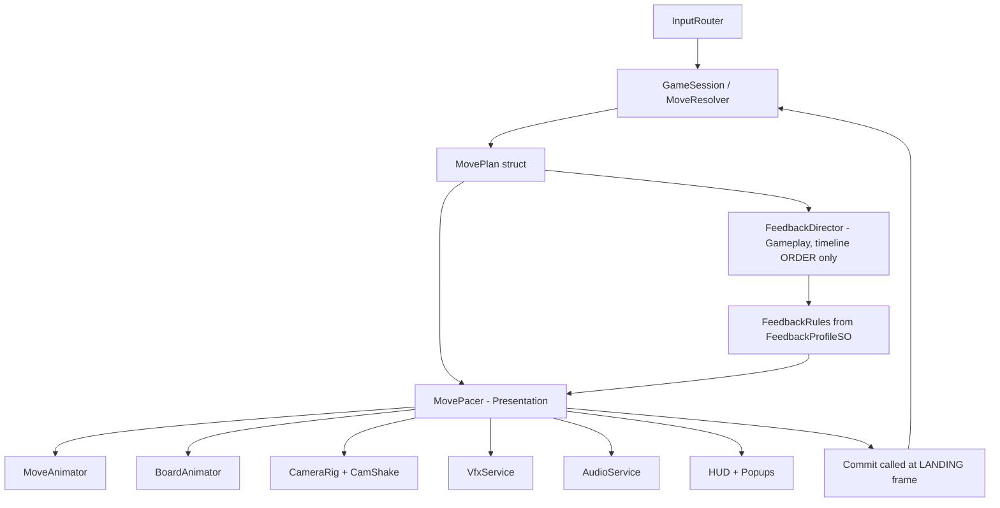
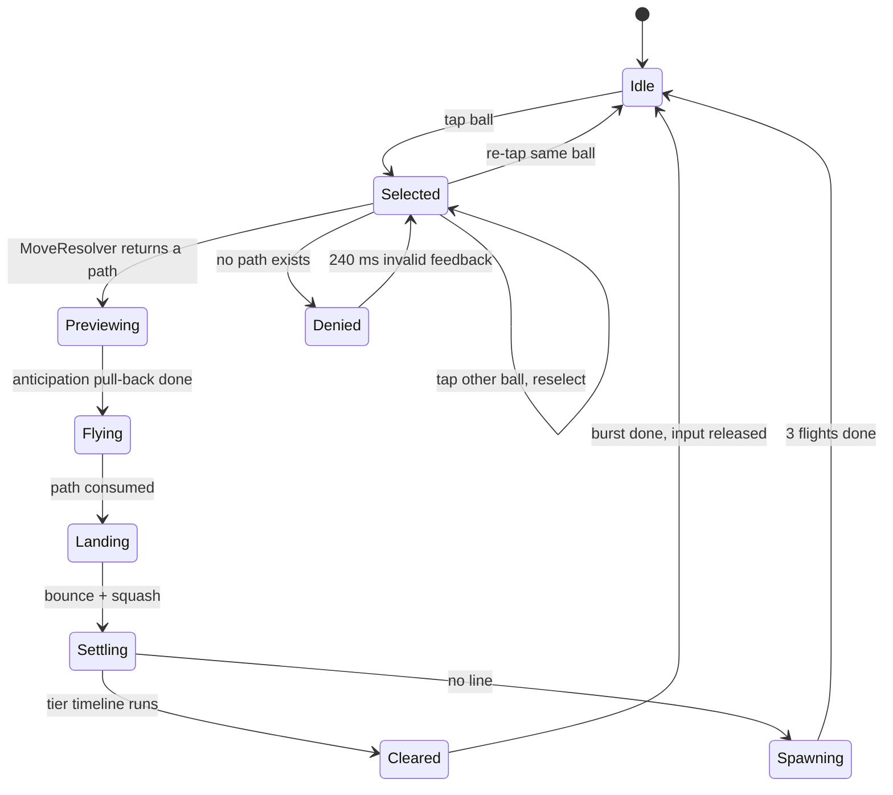

# LINE 98 — Animation, Animator & Animation Asset Plan (V1)

## 0. The three decisions this plan is built on

| # | Decision | Rationale | Fallback if it fails |
|---|---|---|---|
| A1 | **Mecanim is used for exactly 5 objects. It is banned on the board.** | 81 pooled cells + up to 81 pooled balls with `Animator` costs evaluator time per instance, and pooled `Animator` reuse (`Rebind` + `Update(0)`) is a recurring source of bug reports. Board motion is procedural, in `AppRoot.Tick`. | none needed — this is the cheap path |
| A2 | **`AnimationCurve` assets are the animation data; code is the runtime.** Every easing/squash/hop/pulse curve is authored in the Curve Editor and stored as an `.asset`, referenced from one `MotionProfileSO`. | Artist-tunable, zero allocation to sample, no Animator, no clip overhead. Satisfies "premium game feel is a production priority" with an actual authoring surface. | n/a |
| A3 | **Presentation never calls `UnityEngine.Random` and never uses `MaterialPropertyBlock` on balls.** Determinism is owned by `XorShift128`; per-ball glow is a pooled *glow-shell* renderer with its own pre-created material. | Uses a presentation-local RNG for shake phases; honours Architecture decision #2 ("7 shared materials, not per-ball MPB") exactly, including during animation. | If shell count ever exceeds 9, switch shells to 3 shared materials + per-shell MPB (that set is transparent additive and never batched anyway). |

> **A3 detail on batching:** the resting 81 balls stay GPU-instanced with SRP Batcher intact. Animation is achieved through **transform** channels only (position, rotation, scale) — which are instancing-safe — plus ≤9 pooled additive glow shells. No animated shader property is written on the crystal material at runtime, so no SRP Batcher invalidation occurs on the board.

---

## 1. Where animation sits in the pipeline



**Rules that keep this legal:**

1. `FeedbackDirector` (Gameplay) emits a `FeedbackCue { order, tier, holdMs, animationScale, shakeAmp, vfxKey, audioKey }` — **strings and scalars, never prefab or clip references.** Gameplay never references an animation asset (Architecture §8: Gameplay consumes structs, Presentation consumes assets).
2. `MovePacer` is the only place that holds `Action commit`. **Commit fires on the landing frame**, not at timeline end. Rationale: the model becomes authoritative while the clear tail plays, so input can be released mid-tail and autosave is never waiting on cosmetics.
3. The clear sequence, spawn flights and score popups fire **after** commit as pure cosmetics driven by the plan's already-known `ClearGroup` / `SpawnBatch`. Zero visual lies.
4. Presentation uses a **presentation-local clock** (`PresentationRoot.Tick(dt * m_ClockScale)`) for slow-mo. `Time.timeScale` is never touched for feel — it would drag audio and the model with it.

---

## 2. Runtime architecture (Presentation)

```csharp
// Line98.Presentation/Animation/
public interface ITickable { void Tick(float dt); }

// ~300 LOC total, per vocab §13
public enum TimeSource : byte { Scaled, Unscaled }

public struct Tween {
    public float From, To, Duration, Elapsed;
    public AnimationCurve Curve;         // null => Easing delegate
    public Easing Ease;
    public TimeSource Source;
    public int ActionId;                 // pooled callback slot, no closures
}

public sealed class TweenRunner : ITickable {          // single instance, owned by PresentationRoot
    public int Play(in Tween t);                        // returns handle
    public void Cancel(int handle);
    public void CancelByOwner(AnimOwner owner);         // <-- the pool-safety hammer
    public void Tick(float dt);
}

public sealed class Easing {                            // static curves, no allocations
    public static float OutCubic(float t);
    public static float OutBack(float t, float s);
    public static float InExpo(float t);
    public static float OutElastic(float t);
    public static float DampedSine(float t, float lambda, float omega);
}
```

**Two non-obvious pieces worth calling out:**

- **`CancelByOwner`.** Every tween is tagged with the `BallView` / `CellView` / `Screen` that owns it. On pool release the owner cancels its tweens in one call. This is the single defence against the classic "pooled object finishes its old animation on new data" bug — and it is why no coroutines are used anywhere in this system.
- **`DampedSine`** implements GDD §8's "Soft Bounce" in closed form: `y(t) = A·e^(−λt)·cos(ωt)`. Squash/stretch is derived from the same signal (`sy = 1 − k·max(0, −y)/A`, `sx = sz = 1/√sy`) so deformation and bounce are physically coherent, volume-preserving, and infinitely tunable without the physics engine (which the tech stack bans).

**Component inventory (Presentation):**

| Class | Responsibility |
|---|---|
| `PresentationRoot` | Owns `TweenRunner`, `VfxService`, `AudioService`, `CameraRig`, `UIRouter`; the single `Tick` fan-out |
| `MovePacer` | Implements `IMovePacer`; builds the per-move timeline, calls `commit`, releases input at `ReleaseAt` |
| `MoveAnimator` | Ball flight, anticipation, corner arcs, landing bounce + squash, trail reparenting |
| `BoardAnimator` | Cell reveal wipe, ball spawn flights, glow shells, line ribbon, blob-shadow fade |
| `CamShake` | Additive shake child transform — **never writes to the transform `BoardFitSolver` owns** |
| `PathPreviewView` | Shared by Hint (§13) and Onboarding (§31): marching dotted path, terminal cell ripple, arrow head |
| `ScorePopupPool` | 8 pooled world-space TMP popups, format `+180` / `COMBO ×1.5` |
| `RollingNumber` | Score count-up / count-**down** (undo), tabular digits |
| `AnimEventRelay` | Forwards `AnimationEvent` → audio key, used only by the 5 Animator objects |

---

## 3. Ball rig & transform conventions (deliverable to the 3D artist)

The squash must happen **about the contact point**, not the sphere center, or the ball will appear to sink through the cell.

```
BallView.prefab
└── Ball_Root            pivot at the cell FLOOR, y = 0            <-- animated: position, scale
    ├── Ball_Visual      local (0, restHeight, 0), SM_Ball_Gem     <-- never scaled directly
    │   └── (TrailRenderer reparented here during flight only)
    └── GlowShell        SM_Ball_Gem, additive material, scale 1.02, disabled when idle
```

| Convention | Value |
|---|---|
| Cell pitch | `pitch` = `BoardFitSolver` output (view units per cell) |
| Ball rest height | `restHeight = 0.30 × pitch` |
| Ball radius | `0.40 × pitch` (nestles into the `SM_BoardCell` cavity without intersecting) |
| Blob shadow | `0.85 × 0.85` quad on the cell floor, scale tracks `1/y` lift, alpha `0.45 → 0.15` while airborne |
| Rotation | **identity always.** Balls do not roll. Gems hop; rolling fights the crystal read, accumulates float drift, and gains nothing at 9×9. |
| Pivot offset for squash | Root scaling moves the visual's offset → free contact-preserving squash, no pivot change needed |
| FBX import | `SM_Ball_Gem.fbx` with **Import Animation OFF** (tech stack §4: "no animation in mesh"). Zero `SkinnedMeshRenderer`, zero morph targets, zero root motion, project-wide. |

---

## 4. Move FSM (procedural, not Mecanim)



Input re-enable (`ReleaseAt`), by design:

| Situation | Input locked for | Rationale |
|---|---|---|
| Invalid move | 240 ms | Must feel like a refusal, not a freeze |
| Move, no clear | landing + 120 ms tail ≈ **520 ms** | Player is already thinking about the next tap |
| Move + Tier 1 clear | landing + 420 ms ≈ **900 ms** | Released *during* the particle tail |
| Move + Tier 3/4 | landing + 900/1400 ms | The payoff is the product; the lock is the reward |
| Any tail | **tap = 3× fast-forward** | Skilled players never feel blocked |

Total timeline target: **standard clear ≤ 1.0 s to input**
Handedness check: all of the above stays inside one-handed thumb reach — no animation moves HUD elements (the score pill bumps in place, it does not travel).

---

## 5. Feedback timeline spec — the 4 tiers (GDD §8)

Canonical Tier 1 numbers, ms from the landing frame. All values live in `FeedbackProfileSO` and are scaled by `animationScale`.

| Phase | t | Tier 1 (5) | Tier 2 (6–7) | Tier 3 (8) | Tier 4 (9+, Perfect) |
|---|---|---|---|---|---|
| **Connect** — snap 4% toward run centroid | 0 | 90 ms | 90 | 90 | 90 |
| **Pulse** — scale 1.0→1.18→1.0, **staggered outward from the placed ball, 22 ms per cell** | 90 | 170 | 190 | 210 | 240 |
| **Glow** — glow shell ramps 0→intensity, hue pushes toward white | 260 | 160 | 190 | 220 | 260 |
| **Line ribbon** — pooled `LineRenderer` sweeps the run, width 0.06→0.12, scrolling UV | 0 | concurrent | concurrent | concurrent, dual | concurrent, dual + gold tint |
| **Burst** — shells collapse to 0 (`InExpo`), blob shadows fade | 420 | 120 | 130 | 140 | 160 |
| **Particles** | 540 | 300 | 460 | 740 | 1300 |
| **Score popup** — world-space TMP at group centroid, rise 0.6u | 480 | 700 | 700 + combo | 700 + combo | 900 + `PERFECT LINE` banner |
| **Camera shake** (amp, damped sine) | 420 | 0.00 | 0.07 | 0.14 + 60 ms flash | 0.18 + local slow-mo 0.35× for 400 ms |
| **Audio** | 420 | `sfx_clear_tier1` | `tier2` | `tier3` | `tier4_perfect` |
| **Hold before release** | — | 0 | 60 | 180 | 400 |
| **Total to idle** | | **~0.94 s** | **~1.15 s** | **~1.45 s** | **~2.1 s** |

The **stagger direction** (outward from the placed ball along the run, not by cell index) is the highest-value detail in this table: it makes a 7-ball line *read* as a circuit lighting up, which is the difference between "a clear" and "*that* clear". For a cross (2 runs), each run pulses with its own phase; the intersection cell pulses twice (scale only — the shell fires once).

---

## 6. Full animation inventory

`TR` = tween runner, `PS` = Shuriken/particle, `LR` = LineRenderer, `AN` = Animator, `SH` = shader.

### 6.1 Board & ball (the core loop)

| # | Animation | Trigger | Tech | Duration | Curve | VFX / SFX |
|---|---|---|---|---|---|---|
| 1 | Board entry wipe | Game scene ready | TR, staggered by `x+y`, 8 ms/diagonal | 440 ms | `OutCubic` + 0.9→1.0 scale + alpha | `sfx_place` on the last diagonal |
| 2 | Ball group fade-in | after #1 | TR group, +0.05u lift settle | 220 ms | `OutQuad` | — |
| 3 | Ball select halo | tap ball | 1 pooled wrapper moves to the ball, loop | 120 ms in, loop 900 ms | `OutBack` + sine breathe | — / `sfx_ball_select` (pitch 1.0±0.05) |
| 4 | Selection hop + shadow | same frame | TR, root y +0.06u | 140 ms | `DampedSine` | — |
| 5 | Deselect | re-tap / reselect | TR reverse of #3 | 90 ms | `InCubic` | `sfx_ball_deselect` |
| 6 | Path preview | plan resolved | `PathPreviewView`, dotted quads marching, terminal cell ripple ×2 | 160 ms | linear march | `sfx_ball_move_flight` on commit |
| 7 | Anticipation pull-back | flight start | TR, −8% along the reverse of segment 0 | 40 ms | `OutQuad` | — |
| 8 | Ball flight | — | TR waypoint walk + Catmull-Rom smoothing; **decimated to ≤10 waypoints if path > 12 cells** | `clamp(300/steps, 42, 85)` ms per step + 60 + 160 | per-step `InOutQuad`, arc hop 0.12u | shared `TrailRenderer`, tapered 0.34→0.02, 0.22 s fade |
| 9 | Corner turn | `MovePlanner` | arc hop, ball leans 6° into the turn | part of #8 | — | — |
| 10 | Landing bounce + squash | commit frame | TR, `DampedSine` A=0.09u λ=9 ω=28, volume-preserving squash | 160 ms | analytic | `VFX_Placement_Settle` 12 particles / `sfx_ball_place_settle` |
| 11 | Commit acknowledgement | same frame | score pill bump 1.0→1.06→1.0 | 180 ms | `OutBack` | `sfx_ball_place_settle` (same event, not a second click) |
| 12 | Spawn shortfall ghost | preview < 3 fit | TR, slot ball alpha → 0.35, dimmed | 200 ms | linear | — |
| 13 | Spawn flight ×3 | after commit, no-clear | TR, arc from tray slot → destination cell, staggered 70 ms | 420 ms | `InOutQuad` | `sfx_spawn_pop` ×3 (+40 ms each) |
| 14 | Spawn landing | each arrival | TR bounce as #10 at 0.6× scale | 120 ms | analytic | 6-particle micro dust |
| 15 | Preview tray refill | after #13 | TR: slots shift left, new ball slides in from `+slotWidth` | 180 ms, 60 ms stagger | `OutCubic` | `sfx_ball_select` (pitch −0.1) |
| 16 | Invalid move | no path | TR, 3-cycle shake **rotated to the camera-yaw axis** so it reads horizontal on screen; red rim flash | 240 ms | 27 Hz damped | `VFX_Invalid_Shake` / `sfx_ball_invalid` |
| 17 | Rejected destination | tap empty unreachable cell | TR, ring collapse on the cell | 200 ms | `InBack` | — |

### 6.2 Clear, score, progression

| # | Animation | Tech | Duration | Notes |
|---|---|---|---|---|
| 18 | Clear sequence (all 4 tiers) | TR + shells + PS + LR | §5 table | The only animation with a bespoke per-tier asset |
| 19 | Score count-up | `RollingNumber` + TR | 500 ms | Tabular digits, no layout reflow; TMP autosize untouched |
| 20 | Score popup | pooled TMP + TR | 700 ms | `+100` … `+800`; combo lines append `COMBO ×1.5` |
| 21 | Combo badge punch | TR | 260 ms | Text swap first, then scale punch (`OutBack`), tint ramps with the multiplier |
| 22 | New-best crown pop | TR + PS | 900 ms | Fires once per session when score passes best mid-game |
| 23 | Achievement toast | AN or TR + queue | 300 in / 1800 hold / 220 out | Queued; never stacked |
| 24 | Game over sequence | SH overlay + TR + PS | ~2.6 s | Frost/desaturation ripple `_Progress` 0→1 over 1.2 s, board dim 400 ms, camera push-in 8% over 700 ms, modal slide-up 320 ms `OutBack`, stat rows stagger 60 ms with count-ups, score tally 500 ms |
| 25 | Undo (honest, model-driven) | TR + LR + `RollingNumber` | 620 ms | Reverse flight along the reversed plan path 220 ms → restored balls re-materialize at 60 ms stagger → cleared balls fade back in → score counts **down** with a red pill pulse → undo badge punch + number roll → rewind ribbon sweep. Driven by the restored snapshot's view diff, never by a stored animation. |
| 26 | Continue / revive | TR + PS | 1.1 s | Removed balls sink 0.2u and shrink, staggered 50 ms → 3 freed cells breathe a ring pulse → camera pulls back 4% (relief) → `sfx_reward_earned` |
| 27 | Zen calm variant | profile swap | — | `animationScale 0.7`, shake 0, no combo banner, particle cap tightened, no frost on game over — a slow 800 ms alpha fade instead |

### 6.3 UI, menu, meta

| # | Animation | Tech | Notes |
|---|---|---|---|
| 28 | Popup show / hide | **AN** — one shared `UI_Popup_ShowHide.controller` | Root-path clip: `CanvasGroup.alpha` 0→1 + `RectTransform.localScale` 0.92→1.0 (320 ms show / 180 ms hide). Because every property path is the Animator's own GameObject, all 7 popups reuse **one controller and two clips.** |
| 29 | Modal scrim fade | TR | 200 ms, `Unscaled` time source |
| 30 | Main menu entry | TR | Logo breath loop (**AN**, 4 s), mode cards stagger in 70 ms each, background parallax drift |
| 31 | Button press / release | TR | 80 ms press (0.96), 140 ms release `OutBack` — must read as instant by the §8 feel rule (≤100 ms) |
| 32 | Settings toggle | TR + AN | Toggle slide 140 ms; locale rows must survive VI strings 25% longer — animate the container, never the TMP font size |
| 33 | Statistics bars | TR | Fill `OutCubic` 480 ms, 50 ms stagger; no animator (bar count is data-driven) |
| 34 | Daily calendar stamp | **AN** | Day tile slams (scale down + 4° rotation settle), streak flame loop, completion trophy spin |
| 35 | Theme switch | SH mask sweep + TR | 320 ms radial wipe across the board, ball materials swap behind it |
| 36 | Onboarding (6 steps, §31) | `PathPreviewView` + SH mask + **AN** ghost hand | Reuses #3, #6, #16 verbatim on `TutorialSeedSO` — the tutorial **cannot** drift from the shipped game. 20–30 s. |
| 37 | Hint (§13) | `PathPreviewView` | Source ball halo pulse ×2, destination ring ×2, marching path, 1.6 s, never executes |
| 38 | Store capture mode | profile | `MotionProfile_Capture` forces 0.35× clock for M5 trailer/screenshot footage |

**Note on #36/#37:** they share one asset and one class. Building the hint first makes the tutorial nearly free (Architecture §13 decision #6 already recommends shipping the hint).

---

## 7. Animator inventory — exactly five, and why

| Prefab / object | Controller | Clips | updateMode | cullingMode | Notes |
|---|---|---|---|---|---|
| `UI_Popup_Root` (7 screens share it) | `UI_Popup_ShowHide` | `UI_Popup_Show_320`, `UI_Popup_Hide_180` | Normal | **`AlwaysAnimate`** | UI is routinely "off-screen" to the renderer — any culling mode silently freezes UI anims. Both clips key **the same three properties** on the root path; keep `Write Defaults` ON. |
| `UI_BrandLogo` | `Logo_Idle` | `Logo_Idle_4s` (loop) | Normal | `CullUpdateTransforms` | Menu only |
| `VFX_PerfectLine_Banner` | `Banner_ShowHide` | `Banner_Show_900`, `Banner_Hide_260` | Normal | `AlwaysAnimate` | 1 `AnimationEvent` at 380 ms → `AnimEventRelay` → `sfx_clear_tier4_perfect` |
| `Onboarding_GhostHand` | `GhostHand_Loop` | `GhostHand_Tap_1200` (loop) | Normal | `AlwaysAnimate` | Menu/Game overlay |
| `Daily_CalendarStamp` | `Daily_Stamp` | `Stamp_Slam_420`, `Flame_Loop_2s` | Normal | `CullUpdateTransforms` | Daily screen only |

**Banned, and mechanically enforced (see §12):**
`Animator` on any ball, cell, block, tray ball or popup content · `AnimatorController` state machines for gameplay motion · root motion · `AnimationEvent` carrying gameplay logic (cosmetic only) · `Timeline` at runtime (adds a package + an authoring surface for a game whose pacing is data-driven) · `SkinnedMeshRenderer` / morph targets · `Animator.Play` on a pooled object without `Rebind() + Update(0)` · `Animator.SetTrigger` on a pooled object with `keepAnimatorStateOnDisable = true` (Unity 6 name; formerly `keepAnimatorControllerStateOnDisable`).

---

## 8. Animation asset production list

```
Assets/_Project/Content/Animations/
├── Curves/                     # 9 AnimationCurve .assets — the real "anim assets" of this game
│   ├── AC_Ease_OutCubic.asset          (0,0)→(1,1), tangent 0.33/0.0
│   ├── AC_Ease_OutBack.asset           overshoot 1.10 @ t=0.62, settle 1.0
│   ├── AC_Ease_InExpo.asset            flat to t=0.5, then steep
│   ├── AC_Ease_InOutQuad.asset
│   ├── AC_Squash.asset                 sy 1→0.90→1.02→1.0, 5 keys
│   ├── AC_Hop.asset                    y 0→1→0 with asymmetric rise/fall
│   ├── AC_Pulse18.asset                scale 1→1.18→1
│   ├── AC_RimRamp.asset                glow 0→1 hold →0
│   └── AC_FloatUp.asset                popup y 0→0.6, alpha 1→1→0
├── Clips/
│   ├── UI_Popup_Show_320.anim
│   ├── UI_Popup_Hide_180.anim
│   ├── Logo_Idle_4s.anim
│   ├── Banner_Show_900.anim   /  Banner_Hide_260.anim
│   ├── GhostHand_Tap_1200.anim
│   └── Stamp_Slam_420.anim    /  Flame_Loop_2s.anim
├── Controllers/                # the 5 from §7
└── Profiles/
    ├── MotionProfile_Default.asset        # refs all 9 curves + global durations + clock scale
    ├── MotionPreset_Zen.asset             # multipliers: scale 0.7, shake 0, particles 0.6
    └── MotionPreset_ReducedMotion.asset   # scale 0.3, shake 0, ribbons off
```

`MotionProfileSO` (in `Line98.Data`) is the single tuning surface:

```csharp
[CreateAssetMenu(menuName = "Line98/Motion Profile")]
public sealed class MotionProfileSO : ScriptableObject {
    [SerializeField] private AnimationCurve m_OutCubic, m_OutBack, m_InExpo;
    [SerializeField] private AnimationCurve m_Squash, m_Hop, m_Pulse, m_RimRamp, m_FloatUp;
    [SerializeField] private float m_MoveBaseMs = 300f, m_PerStepMinMs = 42f, m_PerStepMaxMs = 85f;
    [SerializeField] private float m_AnticipationMs = 40f, m_LandingMs = 160f;
    [SerializeField] private float m_StaggerPerCellMs = 22f, m_SpawnStaggerMs = 70f;
    [SerializeField] private float m_ClockScale = 1f, m_AnimationScale = 1f, m_ShakeScale = 1f;
    [SerializeField] private int   m_MaxFlightWaypoints = 10;
}
```

Tier data stays in `FeedbackProfileSO` (extended, not replaced) — 4 entries, each with `vfxKey` / `audioKey` **strings**, so Gameplay never touches a Presentation asset:

`{ minLen, maxLen, animationScale, staggerMs, shakeAmp, glowIntensity, holdMs, ribbonWidth, showBanner, allowSlowMo, vfxKey, audioKey }`

---

## 9. Audio-sync map (animation event → SFX key)

| Animation moment | SFX key | Bus |
|---|---|---|
| Select | `sfx_ball_select` (1.0 ± 0.05) | SFX |
| Deselect | `sfx_ball_deselect` | SFX |
| Flight start | `sfx_ball_move_flight` | SFX |
| Landing = commit | `sfx_ball_place_settle` | SFX |
| Spawn arrival (+40 ms each) | `sfx_spawn_pop` | SFX |
| Invalid | `sfx_ball_invalid` | UI |
| Burst | `sfx_clear_tier1..4_perfect` | SFX |
| Combo badge | `sfx_combo_up` | SFX |
| Continue / undo restore | `sfx_reward_earned` | UI |
| Game over frost start | `sfx_game_over` | SFX |
| Button press | `sfx_ui_button_click` | UI |

Zen swaps the bed to `bgm_zen_ambience` on the Ambience bus and drops the combo/fanfare keys — one profile swap, no code branch.

---

## 10. Budgets & guardrails

| Metric | Target | How this plan holds it |
|---|---|---|
| Update loops | **1** | Every animator is `ITickable` under `PresentationRoot.Tick` |
| GC / frame | **0 B** | `Tween` is a struct in a pre-sized list; callbacks are pooled slots; no closures, no `WaitForSeconds`, no LINQ, no string alloc per frame (popup text formatted into a cached char buffer) |
| Animator components | **≤ 5 alive** | §7 |
| Trail renderers | **1** | Shared instance reparented for the duration of a flight, `Clear()` on release |
| Glow shells | **9** | Pooled once, own material each, disabled when idle |
| Line ribbons | **2** | Covers H+V and both diagonals; a 4-run cross reuses by phase |
| Particles | **≤ 4 concurrent** | Enforced by `VfxService`'s ring pool |
| Draw calls added by animation | **≤ 3** | Scale/position are instancing-safe; shells are ≤2 (batched additive), ribbon 1 |
| Shader warm-up | — | `AnimVariants.shaderVariantCollection` warmed during the Game scene load; shells pre-warmed with a hidden off-screen emission before the first clear |
| Slow-mo | Local clock | `m_ClockScale` on `PresentationRoot`; `Time.timeScale` untouched |
| Platform | Variable dt | All durations in ms against real `dt` (Windows dev target runs with vSync ON) |

---

## 11. Milestone mapping (GDD §32 / Architecture §12)

| M | Animation deliverables | Gate |
|---|---|---|
| **M1** | `TweenRunner`, `Easing`, `ITickable`, `MovePacer` + `ImmediatePacer`, and **instant-snap animations only** (ball teleports, clear is a 1-frame despawn). Nothing aesthetic. | EditMode tests green; a full game playable with primitives |
| **M2** | All 9 curves, `MotionProfile_Default`, `MoveAnimator`, `BoardAnimator`, glow shells, trail, ribbons, §5 tiers, `CamShake`, board entry, spawn flights, score popup, `VFX_*` prefabs | 60 FPS on low-end target; §8 sequences match the §5 timings; Frame Debugger confirms ≤15 DC |
| **M3** | UI popup controller + 2 clips, menu entry, rolling numbers, undo sequence, game-over sequence, achievements toast, daily stamp, hint preview, Zen preset | Relaunch mid-game resumes identically; undo visually honest |
| **M5** | Onboarding sequences, reduced-motion preset, theme switch wipe, capture preset for store footage, warm-up pass | §33 checklist + 60 FPS on the low-end matrix |

---

## 12. Tests & CI additions (extends Architecture §11)

| Suite | Assertions |
|---|---|
| `MotionProfileTests` | All 4 tiers present; `animationScale`, `holdMs`, `shakeAmp` monotonic across tiers; every `vfxKey` / `audioKey` resolves in the catalogs |
| `TweenRunnerTests` | Cancel-by-owner releases every handle; simulated-dt determinism; zero allocations over 10 000 ticks and 1 000 play/cancel cycles |
| `MovePacerTests` | With `ImmediatePacer`, commit order is exactly `validate → animate → mutate → detect → score → spawn → game over → autosave`; commit fires at landing; `ReleaseAt` never exceeds the lock budget |
| `ArchitectureTests` (+2 rules) | **No `Animator` under `Content/Prefabs/Board/`.** No `AnimationClip` / `AnimatorController` / `UnityEngine.AnimationModule` reference from `Line98.Core`, `Line98.Gameplay`, or `Line98.Services`. No `UnityEngine.Random` in `Line98.Presentation`. |
| `AnimAssetAuditTests` (Editor) | Every `.anim` referenced by a controller exists; every controller is referenced by a prefab; orphan `.anim`/`.asset` under `Content/Animations/` fails the build |
| `SmokeTests` (PlayMode) | Existing flow, plus: assert the animator count is 0 on the board root, assert `MaterialPropertyBlock` is never set on a ball renderer (spy), assert `Time.timeScale` is untouched after a tier-4 clear |

---

## 13. Deviations, clarifications and gaps found in the references

| # | Item | Action needed |
|---|---|---|
| 1 | **`FeedbackProfileSO` must hold string keys, not prefab/audio refs.** Design assets §7 lists the asset as "Maps 5, 6–7, 8, 9+ to VFX, SFX and Camera Shake", which would drag `ParticleSystem` and `AudioClip` references into the Gameplay-consumed asset. | Clarification: split scalars + keys (Gameplay) from asset resolution (Presentation via `VfxCatalogSO` / `AudioCatalogSO`). |
| 2 | **Ball palette mismatch.** Core enum is `Red, Orange, Yellow, Green, Cyan, Purple, Pink`; Design assets lists `M_Ball_Blue` (#1565C0) in place of Pink. | Sign-off: keep the enum as the contract (Pink), or swap Pink → Blue everywhere. Animation depends on this because the trail, glow shell and ribbon are all hue-derived. |
| 3 | **Trail colour vs shared materials.** Design assets' shared-material decision (correctly) rules out per-ball MPB, but the trail must match the ball hue. | Resolution in §3: the `TrailRenderer`'s `colorGradient` is written per flight from the ball's `BallColor` — a single component, never batched, so no batching cost. |
| 4 | **Slow-mo for the Perfect Line tier** is implied by "special Perfect Line presentation" but never specified. | Proposed: 0.35× local clock for 400 ms on the burst only, presentation-local, never `Time.timeScale`. |
| 5 | **Reduced-motion accessibility** is not in the GDD at all; the only a11y item is the pattern toggle (gap #11). | Proposed: ship `MotionPreset_ReducedMotion` (scale 0.3, no shake, no ribbons). Cheap, and it is the same asset swap as the Zen preset. |
| 6 | **Animation lock vs. GDD's "instant feel."** The plan's Tier-3/4 locks run up to 1.4 s. | Proposed: tap-to-fast-forward during any tail. Protects both the payoff and the flow. |
| 7 | **Editor version.** Tech stack pins `6000.6.0f1` per ADR D1 while Architecture §1 says "one `6000.0.x` LTS patch". | Confirm once at project creation; `Animator.keepAnimatorStateOnDisable` and the UI `AlwaysAnimate` behaviour about which I'm being cautious are both stable across Unity 6, so this is not an animation blocker. |
