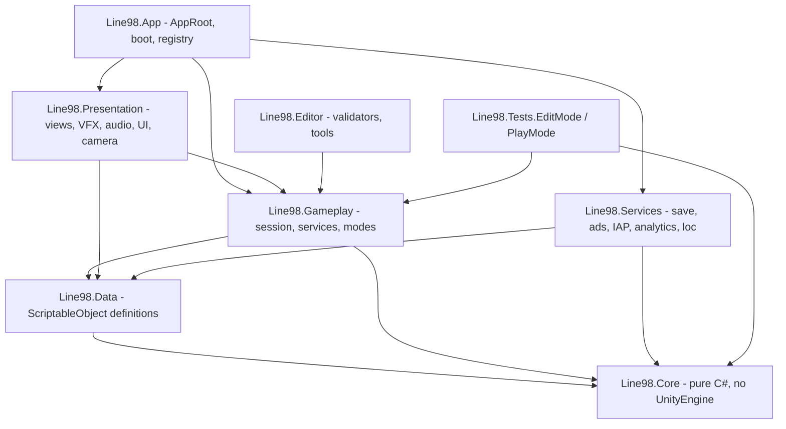
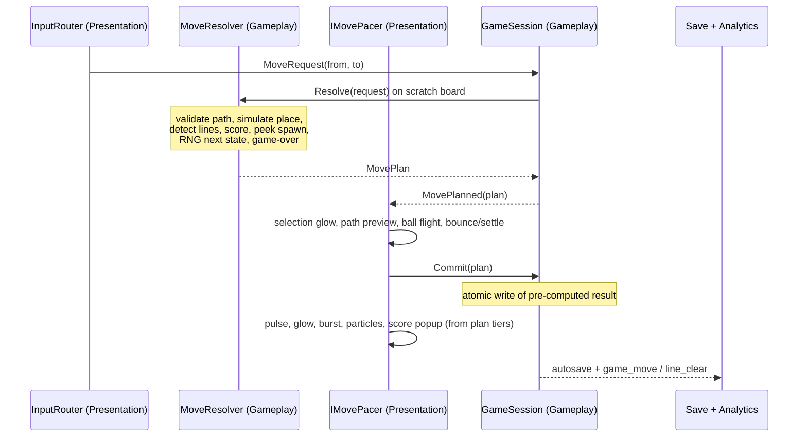

# LINE 98: Color Lines — High-Level Architecture

## 0. Architecture at a glance

**One sentence:** a pure-C# deterministic 9×9 simulation, wrapped by a plan/commit pipeline, projected by a view layer that may lag the model but can never drive it, with vendor SDKs behind NoOp-swappable interfaces.

| Principle | Mechanism | Source |
|---|---|---|
| Determinism is structural | `XorShift128` in Core; `UnityEngine.Random` banned in Core+Gameplay | §25, §15 |
| Gameplay cannot see Presentation | 7 asmdefs, one-way edges, CI test parses asmdefs | §25, vocab §2 |
| Presentation may lag, never lead | `MovePlan` → animate → `Commit` | §8 + vocab §7 |
| Offline is the default state | Every network service resolves to `NoOp*`; nothing awaited on boot/gameplay path | §22, §33 |
| Data-driven tuning | `*SO` assets compiled to immutable Core rule structs | §7, §10, §16, §17 |
| No framework gravity | Hand-rolled pooling/tween/FSM/DI (~300 LOC) | §34, vocab §13 |

**Four load-bearing decisions** (details in §3, §5, §10, and §13):

1. **Plan → Present → Commit.** The move is fully simulated on an 81-byte scratch board *before* anything animates, then committed atomically. This is the only way to honour both §8's "animate then place" and §25's purity without lying to the player or the model.
2. **Legal-move / game-over detection is O(81) adjacency, not BFS.** A legal move exists iff *some ball has an empty 4-neighbour*; no flood fill needed for the check.
3. **7 shared ball materials, not per-ball `MaterialPropertyBlock`.** MPB-per-renderer defeats instancing and SRP batching — vocab §9's "1–2 draw calls via MPB" is optimistic. 7 materials × GPU instancing gives ~7 draw calls and keeps `TrailRenderer`/pulse animations simple.
4. **Two asmdef edges are added to vocab §2:** `App → Presentation` and `Services → Data` (both are required by the doc's own class list; see §2).

---

## 1. Layer graph and physical layout



Enforced by `ArchitectureTests` (EditMode): parse the 7 `.asmdef` files, assert the edge set above is exactly what exists. Any new edge fails CI — this is how "Gameplay never references Presentation" survives month 4.

| Layer | asmdef settings | Owns |
|---|---|---|
| `Line98.Core` | `"noEngineReferences": true` | `BoardModel`, `Pathfinder`, `LineDetector`, `ScoreEvaluator`, `XorShift128`, `SpawnPolicy`, `GameSnapshot`, `MovePlan` |
| `Line98.Data` | refs Core | `*SO` assets, enums, `ToRules()` mappers |
| `Line98.Gameplay` | refs Core, Data | `GameSession`, `MoveResolver`, `SpawnService`, `ScoreService`, `UndoService`, `HintService`, `ReviveService`, mode strategies, `FeedbackDirector` (timeline *order*, not visuals) |
| `Line98.App` | refs Gameplay, Presentation, Services, Data | `AppRoot` (composition root), `ServiceRegistry`, `GameManager`, boot flow, platform hooks |
| `Line98.Presentation` | refs Gameplay, Data | `BoardView`, `BallView`, `MoveAnimator`, `InputRouter`, `CameraRig`, `VfxService`, `AudioService`, `UIRouter`, screens |
| `Line98.Services` | refs Core, Data | `SaveService`, `StatisticsService`, `AchievementService`, `CosmeticService`, `AdMobAdService`, `UnityIapService`, analytics adapters, localization wrapper |
| `Line98.Editor` | Editor-only | validators, balance tools, SO inspectors |

Physical tree — GDD §4's folder names are honoured as *subfolders*; the compile unit is the 7 asmdefs, because that is where dependency direction is mechanically checkable:

```text
Assets/_Project/
  Core/            Gameplay/        App/
  Data/            -- Definitions/  -- Definitions/
  Presentation/    -- Board/ -- UI/ -- Audio/ -- Vfx/ -- Camera/
  Services/        -- Save/ -- Ads/ -- Iap/ -- Analytics/ -- Localization/
  Editor/          Tests/EditMode/  Tests/PlayMode/
  Content/         -- Scenes/ Boot.unity Menu.unity Game.unity
                   -- Prefabs/ -- Materials/ -- Themes/ -- Audio/ -- Localization/
```

Unity version pin goes in `ProjectSettings/ProjectVersion.txt` (one `6000.0.x` LTS patch for M1–M5, single upgrade window at M3).

---

## 2. Composition root, scenes, boot

- **One Update entry point.** `AppRoot.Tick(dt)` → `PresentationRoot.Tick(dt)` → `ITickable` animators. No `MonoBehaviour.Update` scattered across views (§25 "no unnecessary Update loops"); everything else is event-driven or coroutine-free.
- **Manual DI.** `ServiceRegistry` is a typed locator filled in `AppRoot.Awake()` in a fixed order. No container.
- **Boot order (no network on this path):** load `SaveService` → migrate → load settings/locale → build `ServiceRegistry` with `NoOp*` fallbacks → load `Menu`. Booting never awaits an SDK; ad/IAP SDKs initialise *after* first frame, off the play path.
- **Scene flow:** `Boot` is never unloaded (holds `AppRoot`, `ServiceRegistry`, `AudioService`, `CameraRig`). `Menu` and `Game` swap as single additive loads through `GameManager`. `UIRouter` activates/deactivates screen prefabs referenced by the loaded scene — no Addressables for UI (Addressables is themes + audio only, local groups).
- **`GamePhase`:** `Boot → Menu → Playing → Resolving → Paused → GameOver`. Only `Resolving` locks input at the model level.

---

## 3. The move pipeline — Plan → Present → Commit

This is the core of the architecture. Vocab §7's resolve order is `validate → animate → mutate → detect → score → spawn → game-over → autosave`. That order is only satisfiable if detection/score are computed *before* mutation — so they run on a scratch copy.



**Contract:**

```csharp
// Gameplay — plan is a struct over session-owned scratch buffers; valid until commit or discard.
MovePlan MoveResolver.Resolve(in MoveRequest request);   // never mutates BoardModel
void     GameSession.Commit(in MovePlan plan);           // atomic: board, queue, RNG, score, stats, snapshot

// The one narrow inversion seam. Presentation paces; tests use ImmediatePacer (zero frames).
public interface IMovePacer { void Play(in MovePlan plan, Action commit); }
```

Guarantees this buys:

- **Zero visual lies.** The ball never animates toward a destination that turns out unreachable, and clear VFX never fires for a group that doesn't clear — the outcome is already known.
- **Atomic model transition.** No half-applied move exists, so undo snapshots are trivially correct and autosave only ever serialises consistent state.
- **Determinism.** The plan carries the post-spawn `XorShift128` state; commit writes it. Replaying the same input sequence reproduces the same game exactly.
- **Testability.** `ImmediatePacer` runs the whole pipeline synchronously in EditMode and in the headless balance harness.
- **Interruption safety.** App backgrounded mid-flight → the move simply never committed, nothing was lost, no save needed. Input lock is two-layer: `InputRouter` blocks taps while a timeline is active (UX), `GameSession` rejects requests while `Resolving` (correctness).

Piecewise presentation (§8 tiers) is driven by `FeedbackDirector` off `MovePlan` fields — `Path.Length`, `ClearGroup.LongestRun`, `ClearGroup.RunCount`, `ScoreDelta`, `IsPerfect` — mapped through `FeedbackProfileSO`. Presentation is a subscriber at every arrow, never a participant.

---

## 4. Core domain contract

```csharp
// Line98.Core — zero UnityEngine
enum BallColor : byte { None, Red, Orange, Yellow, Green, Cyan, Purple, Pink }
readonly struct GridPos { byte X, Y; int Index => Y*9+X; }

sealed class BoardModel              // byte[81] colors + ulong[2] occupancy + EmptyCount
struct XorShift128                   // 4×ulong, snapshot-able, SeedFrom(uint)
static class Pathfinder              // BFS 4-dir, int[81] queue + int[81] parent + ulong[2] visited, static preallocated
static class LineDetector            // Scan(4 axes) + TryBuildClearGroup → ulong[2] dedupe mask → sorted indices
struct LineRun / ClearGroup          // ClearGroup = deduped union; Count, LongestRun, RunCount
struct ScoreRules / static ScoreEvaluator
struct SpawnBatch / SpawnPolicy      // picks cells from RNG over empty set
struct MoveRequest / MovePlan / MoveResult
struct GameSnapshot                  // board[81] + selected + queue[3] + rng (4×ulong) + score + moves + stat deltas
enum GamePhase / MoveOutcome
```

Rules: no LINQ, no allocation per move, no `HashSet` (occupancy masks instead), all hot buffers pre-allocated and reused. Everything here is P/Invoke-free and flavour-agnostic — this assembly is the thing you unit test to death.

---

## 5. Gameplay model

| Concern | Design |
|---|---|
| **Session** | `GameSession` is the single command target: `Resolve`, `Commit`, `Undo`, `RequestHint`, `PrepareContinue`. Owns `BoardModel`, `PreviewQueue`, `XorShift128`, `GameSnapshotPool`. |
| **Modes** | `IGameModeStrategy` supplies `ScoringEnabled`, `AdsEnabled`, `UndoPolicy`, `SeedFactory`, `SpawnPolicy`, `HintAllowed`, `RecordsStatistics`. Three implementations: `ClassicMode`, `DailyChallengeMode`, `ZenMode`. |
| **Spawning** | `SpawnService` fills the 3-slot preview ring buffer from RNG, commits only on resolve. **Spawned balls never trigger line detection** (original rule). If <3 cells free, spawn what fits and show the shortfall in the preview; 0 fits → game over. |
| **Game over** | `someBallHasEmpty4Neighbour == false` → game over. O(81), no BFS, runs every commit. Plus the "spawn cannot place anything" case. |
| **Line detection** | 4 axial scans from the placed cell, both directions, into `Span<LineRun>(stackalloc, 4)`; union via occupancy mask → no double-clear possible *structurally*. Overlapping runs (a cross) award each distinct run, shared cell counted once. |
| **Scoring** | `ScoreTableSO` → `ScoreRules`; `base(length)` + `total × (1 + comboStep × (runCount − 1))` capped ×2.0; longest-line relief on the best run only. |
| **Undo** | Snapshot pushed **before** commit, so it captures pre-move RNG — the only thing that makes undo real (and the reason undo must exist at the session level, not the view). 3 free per run; then rewarded, max 3 more. Disabled in Daily. |
| **Hint** | For each ball: one BFS flood of its free region (also reused for the selection highlight), then simulate candidate placements against a scratch board, rank by score then by opened free area. Never executes. |
| **Continue** | `ReviveService` produces a `ContinuePayload` (remove N lowest-value balls, free ≥3 cells, one move) applied through the *normal* pipeline, then re-checks game over. A board edit, not a state hack. |
| **Daily** | `seed = Fnv1a32($"{date:yyyy-MM-dd}-v1")` → starting layout + entire spawn sequence. Streak `{lastCompletedDate, current, longest}` with 1-day grace. No backend. |

---

## 6. Presentation architecture

| Component | Design |
|---|---|
| **`BoardView`** | Projector, not authority. Reads `BoardModel` diffs and converges visuals; world position = `origin + (x,0,y) * pitch` on the tilted board root (tilt lives *only* here). |
| **Balls** | Pooled `BallView` GameObjects, one shared material per `BallColor` (7), GPU instancing ON → ~7 draw calls. Moving ball gets a temporary `TrailRenderer`. No colliders anywhere. |
| **Input** | `InputRouter` → `Plane.Raycast` on the mathematical board plane → `GridPos`. FSM: `None → BallSelected → (PathPreview ∪ DestinationHighlight) → MoveRequest`. Re-tap selected = deselect; tap other ball = reselect. Drag behind an off-by-default flag. |
| **Feedback** | `FeedbackDirector` owns the presentation timeline and the input lock during it; `FeedbackProfileSO` per tier (5 / 6–7 / 8 / 9+), with 9+ getting the PERFECT LINE banner and its own fanfare. |
| **Camera** | `CameraRig` + `CameraProfileSO` (3D orthogonal projection, tiltX ≈58°, yaw 0°, distance, parallax); `BoardFitSolver.SolveOrthographicSize` projects the 4 board corners and iterates `orthographicSize` until 9×9 fits 9:16 → 9:22 without perspective distortion. Procedural, not authored per device. |
| **VFX** | Pooled `ParticleSystem` prefabs; concurrency cap ≤4; score popup = world-space TMP. No VFX Graph. |
| **Audio** | `AudioService`: 2 music sources + pooled SFX, `MainMixer` (Master/Music/SFX/UI/Ambience), Zen snapshot; toggles persisted. |
| **UI** | uGUI + TMP, 1080×1920 reference, `SafeAreaFitter`, **3 canvases** (static HUD / dynamic score / popups) so the score doesn't rebuild the HUD. Screens: `MainMenu`, `Hud`, `Settings`, `Statistics`, `Daily`, `GameOver`, `Continue`, `Cosmetics`. No energy/lives/coins/level map ever. |
| **Onboarding** | `OnboardingDirector` + `OnboardingStepSO[]` + `TutorialSeedSO`, executed through the real `GameSession` — it cannot drift from the shipped game. 6 steps, 20–30 s. |

---

## 7. Services and the vendor boundary

```csharp
IAnalyticsService   → DebugAnalyticsService (V1) | NoOpAnalyticsService
IAdService          → AdMobAdService | NoOpAdService
IIapService         → UnityIapService | EditorStubIapService
IDailyChallengeProvider → LocalDateProvider | (future server)
ILeaderboardProvider → NullLeaderboard (V1)
ISaveBackend        → FileSaveBackend | InMemorySaveBackend (tests)
ILocalizationService → UnityLocalizationAdapter
IAdGate             → per-feature reward gate (continue / undo / hint)
```

Rules: interfaces exist **only** at these seams; everything else is a concrete class. `Line98.Gameplay` references no ad/IAP/analytics assembly — verified by the asmdef test. `InterstitialScheduler` is the single place every §21 rule becomes a boolean: not first session, ≥150 s, never in `Resolving`, never within 2 moves of a clear, only on `GameOver→NewGame` / menu returns. Rewards granted only on `OnUserEarnedReward`.

`IMovePacer`, `ISaveBackend`, and the ad gates are the only externally-implemented interfaces Gameplay knows about.

---

## 8. Data and content pipeline

`*SO` assets **never** enter Core. Each has a `ToRules()`/`ToProfile()` mapper that produces a plain struct; Core and Gameplay consume structs, Presentation consumes assets directly. Assets: `GameConfigSO`, `ScoreTableSO`, `SpawnColorPolicySO`, `FeedbackProfileSO`, `BallThemeSO`, `BoardThemeSO`, `ClearEffectSO`, `CameraProfileSO`, `AchievementSO`, `AudioCatalogSO`, `VfxCatalogSO`, `ModeDefinitionSO`, `DailyChallengeConfigSO`.

Art/audio pipeline stays as specified in the tech doc (Blender meshes, `CrystalBall.shadergraph`, ASTC 6×6 / mips off for UI, Be Vietnam Pro or Inter with VI diacritics — non-negotiable since VI ships in V1). Themes and audio load through Addressables from local groups; everything else is scene-direct.

---

## 9. Save, undo and determinism

`SaveData { version, session, stats, progress, settings, daily, freeUndosRemaining }` via Newtonsoft, written `save.tmp` → `File.Replace(tmp, save.json, save.bak)`. Hooks: **after commit** (never mid-animation), `OnApplicationPause(true)`, `OnApplicationFocus(false)`, `OnApplicationQuit`. Corrupt file falls back to `.bak`; unknown version runs `SaveMigrations`. Because commits are atomic, the save file can never contain a partially applied move.

---

## 10. Performance budget

| Lever | Target |
|---|---|
| Draw calls | ~7 balls + 1 board + 1 shadow + ≤5 UI ≈ 15 |
| GC | 0 B/frame in gameplay; 0 B per move; static preallocated buffers |
| Particles | ≤4 concurrent bursts, pooled, cap enforced by `VfxService` |
| Audio voices | ≤8 |
| Update loops | 1 (`AppRoot.Tick`); all animators are `ITickable` |
| Lighting | No realtime shadows, blob decals; no baked GI |
| Build | AAB ≤25 MB target / ≤40 MB hard; IL2CPP, ARM64, stripping High + `link.xml` |

Do not optimise the 81-cell simulation — it is already sub-microsecond. All remaining cost is presentation.

---

## 11. Testing and CI gate

EditMode suites: `BoardModelTests`, `PathfinderTests`, `LineDetectorTests`, `ScoreServiceTests`, `SpawnServiceTests`, `UndoServiceTests`, `SaveServiceTests`, `DailyChallengeServiceTests`, `AchievementServiceTests`, plus two additions I consider mandatory:

- **`ArchitectureTests`** — asmdef edge set, ban on banned type names (no `CurrencyService`/`EnergyService`/`LevelGraph`), ban on `UnityEngine.Random` in Core/Gameplay.
- **`DeterminismReplayTests`** — record an input + seed sequence, replay, assert identical board/score/queue/RNG. This is the regression net for the whole two-phase pipeline.

PlayMode: one `SmokeTests` boot → classic → move → clear → spawn → game over → continue → new game. CI: `-warnaserror`, EditMode suite, one PlayMode smoke, IL2CPP size check.

---

## 12. Build order (milestone-gated)

| M | Produces | Gate |
|---|---|---|
| **M1** | asmdefs, `.editorconfig`, CI, `Line98.Core` + `Line98.Gameplay` + `AppRoot` + IMGUI debug HUD, `Boot`/`Game` scenes. Nothing else. | All EditMode tests green; a full game playable with primitives |
| **M2** | `Line98.Presentation`: `BoardView`, `BallView`, `MoveAnimator`, `FeedbackDirector`, VFX, audio, `CameraRig`, URP materials | 60 FPS low-end; §8 sequences match |
| **M3** | `Line98.Services`: save, stats, undo, hint, daily, zen, achievements, menu, settings | Relaunch mid-game resumes identically; streak works offline |
| **M4** | Ad/IAP adapters, `InterstitialScheduler`, continue, remove-ads | Interstitial rules provably respected (log-based test) |
| **M5** | Onboarding, EN/VI, icon, screenshots, perf pass, consent | §33 checklist fully ticked |

M1 file order inside Core (`GridPos` → `BallColor` → `BoardModel` → `XorShift128` + FNV → `Pathfinder` → `LineDetector`/`ClearGroup` → `ScoreEvaluator` → `SpawnPolicy`/`PreviewQueue` → `GameSnapshot`/`MovePlan`), then Gameplay (`MoveResolver` → `GameSession` → `SpawnService` → `ScoreService` → `UndoService` → modes), then App. Tests land with each file, not after. No `Line98.Services` code exists until Core tests are green in CI.

---

## 13. Decisions needing your sign-off

| # | Decision | My recommendation |
|---|---|---|
| 1 | Plan→Present→Commit pipeline vs naive mutate-then-animate | **Pipeline.** It is the only shape that satisfies §8 + §25 together and it makes undo/autosave/determinism fall out for free. |
| 2 | Ball rendering: 7 shared materials vs per-ball MPB | **7 materials + instancing.** MPB per renderer breaks instancing; correction to vocab §9. |
| 3 | Game-over check: board-full vs spawn-failure vs no-legal-move | **Both:** spawn cannot place anything, **or** no ball has an empty 4-neighbour. |
| 4 | Spawn placement policy | Uniform RNG over empty cells (authentic); keep `SpawnPolicy` as the swap seam for a "no 4-in-a-row" variant. |
| 5 | Colour ramp over the run | 5 colours → 6th after 10 lines → 7th after 25 lines. Biggest difficulty/retention knob in the game; must be data-driven. |
| 6 | Hint in V1 or V1.1 | Build the service in M3 (~1 day), gate the button on `IGameModeStrategy.AllowsHint`. Ship it — it uses logic you already have. |
| 7 | Draw-call ambition | Accept ~15 total instead of the doc's optimistic 1–5; the CPU cost of tinting 81 balls is not the bottleneck on low-end Android. |
