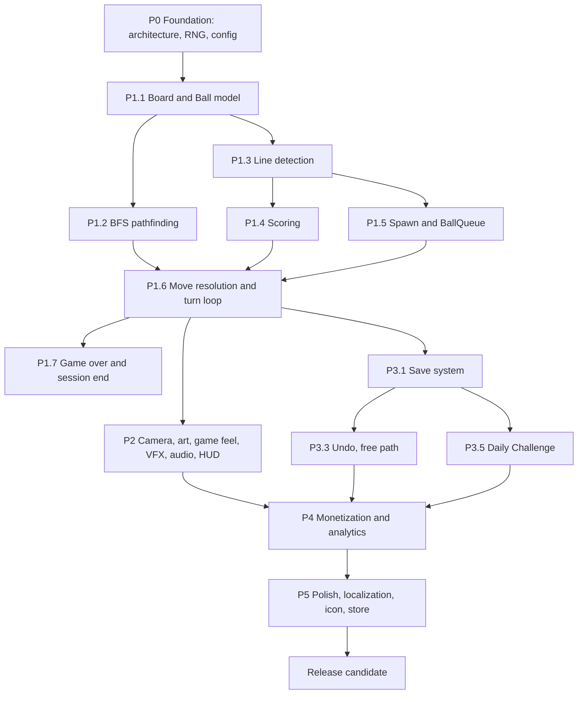

## PART 0 — HOW TO USE THIS DOCUMENT

The Base GDD is organized by **feature domain** (what the game is). This edition is organized by **build dependency** (what must exist before the next thing can be built).

| Rule | Detail |
|---|---|
| Reading order | Top → bottom **is** the build order. |
| Tags | `[R]` reference/guardrails · `[P#]` implementation phase · `[X]` execution meta |
| Section header | Every section carries `Type`, `Depends on`, `Unblocks`, `Exit criteria` |
| Content fidelity | All base numbers/thresholds preserved verbatim (9×9/81, 7 colors, 5+, 3 spawns, 100/180/300/500/800, 3 undos, 2–3 min interstitial cap, `YYYY-MM-DD-v1`, 20–30s onboarding) |
| Rule of thumb | Phase N gate must pass before Phase N+1 work begins — except explicitly marked parallel tracks |

### The ten ordering decisions that matter most

1. **Deterministic RNG moves to Phase 0.** Base GDD mentions "Deterministic RNG" only in §25 and assumes it in §12/§15/§23. Save, Undo and Daily all require it — it is a root dependency, not a quality checkbox.
2. **Board model precedes pathfinding and line detection.** Both consume cell occupancy; neither owns it.
3. **Logic is built headless first.** Board, BFS, line detection, scoring, spawn and turn resolution are pure C# with zero Unity presentation deps. A throwaway debug HUD (base §11 content is *not* required yet) keeps Phase 1 playable.
4. **Game Feel (base §8) is spec'd during Phase 1, built in Phase 2.** Base GDD calls it "a major production priority" — it is, but it can only be tuned against a stable move/clear/move loop. Authoring the timing specs early prevents an art bottleneck.
5. **Art/Audio/VFX asset production is a parallel track to Phase 1 coding.** Materials, SFX and VFX graphs have no code dependency on the turn loop; they're asset-only. Start them while Phase 1 is written.
6. **Save System is Phase 3's first task, not a late chore.** It must exist before Undo, Statistics, Streak and Daily have anything to persist.
7. **Undo is built twice, deliberately.** Free-path undo (state snapshot/restore) in Phase 3; the rewarded-ad path is a thin wrapper added in Phase 4. Do not couple Undo to the ad SDK.
8. **Continue follows the same split.** `[P3.11]` builds the non-ad recovery mechanic (clear balls → restore empty cells → one recovery move). `[P4.3]` adds the rewarded gate.
9. **Main Menu comes after Save/Statistics**, because the menu displays best score, streak and persistent state. Building it earlier forces mock data and rework.
10. **Hint, Cosmetic Theme #2, and leaderboards are launch-flexible.** Base GDD already flags Hint as deferrable (§13). Treat these as `V1.1` candidates the moment Phase 3 slips.

### Interface freeze points (declare in `[P0.1]`, wire later)

These signatures must be frozen in Phase 0 so Phases 3–4 wire in without refactoring gameplay:

`IRandomSource` (serializable state) · `ISaveService` · `IScoreConfig` · `IAnalyticsService` · `IAdService` · `IPurchaseService` · `IDailyChallengeProvider` · `ILeaderboardProvider` · `IThemeProvider` · `IAchievementService`

### Phase map

| Phase | Tag range | Goal | Base milestone equivalent | Gate to exit |
|---|---|---|---|---|
| Foundation | `P0.x` | Skeleton, interfaces, config, RNG | (pre-M1 groundwork) | Project compiles clean, folders + interface stubs exist, RNG is serializable |
| Core Logic | `P1.x` | Headless, deterministic, testable puzzle | **Milestone 1 — Playable Core** | Core test matrix green; game playable start→game over via debug HUD |
| Presentation | `P2.x` | Camera, art, animation, VFX, audio, real HUD | **Milestone 2 — Game Feel** | 60 FPS with pooled VFX; feedback tiers 5/6–7/8/9+ all distinct |
| Product Layer | `P3.x` | Persistence, meta systems, modes | **Milestone 3 — Product Layer** | Game survives app kill; Undo/Daily/Zen/Achievements functional; no crash on missing network |
| Monetization | `P4.x` | Ads + IAP + telemetry | **Milestone 4 — Monetization** | Rewarded flows grant correctly; interstitials respect all 5 caps; Remove Ads respected |
| Polish | `P5.x` | Onboarding, localization, perf, store | **Milestone 5 — Polish** | Base §33 Definition of Done fully signed off |
| Execution | `X.x` | Milestone + sequence reference | §32 / §36 | — |

### Critical path



**Parallel track A (runs during P1):** ball/board materials, SFX set, VFX graphs, P2 animation timing specs.
**Parallel track B (runs during P2):** localization string table authoring, analytics event taxonomy, ad SDK integration spike.

### Base → New cross-reference

| Base § | Title | New tags |
|---|---|---|
| 1 | Product Overview | `R1` |
| 2 | Core Gameplay | `P1.1`, `P1.3`, `P1.5`, `P1.6`, `P1.7` |
| 3 | Game Modes | `P3.4` |
| 4 | Core Technical Architecture | `P0.1` |
| 5 | Pathfinding | `P1.2` |
| 6 | Line Detection | `P1.3` |
| 7 | Scoring | `P1.4` |
| 8 | Game Feel | `P2.3`, `P2.4` |
| 9 | Visual Direction | `P2.1`, `P2.2` |
| 10 | Camera | `P2.1` |
| 11 | UI | `P2.7`, `P3.6`, `P3.10` |
| 12 | Undo | `P3.3`, `P4.3` |
| 13 | Hint | `P3.8`, `P4.3` |
| 14 | Continue | `P3.11`, `P4.3` |
| 15 | Daily Challenge | `P3.5` |
| 16 | Cosmetics | `P3.9` |
| 17 | Achievements | `P3.7` |
| 18 | Statistics | `P3.2` |
| 19 | Audio | `P2.6`, `P3.10` |
| 20 | VFX | `P2.5` |
| 21 | Monetization | `P4.1` |
| 22 | Offline-First | `P5.4` |
| 23 | Save System | `P3.1` |
| 24 | Analytics | `P4.2` |
| 25 | Technical Quality | `P0.2` |
| 26 | Testing | `P1.8`, `P5.3` |
| 27 | Performance Target | `P5.3` |
| 28 | Localization | `P5.2` |
| 29 | ASO | `P5.5` |
| 30 | Icon | `P5.6` |
| 31 | Onboarding | `P5.1` |
| 32 | Development Milestones | `X1` |
| 33 | Definition of Done | `R4` |
| 34 | Explicit Non-Goals | `R3` |
| 35 | Final Product Principle | `R2` |
| 36 | Immediate Production Sequence | `X2` |

---

# PART I — REFERENCE & GUARDRAILS
*No build work. Read once, then use as acceptance filters.*

## [R1] Product Overview

**Type:** Reference · **Depends on:** — · **Unblocks:** all phases

**Working Product Name:** LINE 98: Color Lines
**Brand:** LINE 98
**Genre:** Evergreen Puzzle · **Platform:** Android first · **Engine:** Unity
**Orientation:** Portrait · **Business Model:** Ads + Remove Ads IAP
**Target:** Solo developer + AI-assisted production
**Product Strategy:** Low-cost, long-tail organic acquisition, evergreen lifecycle.

### Core Principle

**Simple Core + Premium Execution + Long Lifetime**

The original Line 98 mechanic is the asset. Do not replace the core puzzle simply because it is old.

**Modernize:** visual quality · animation and game feel · sound · UX · daily engagement · statistics · cosmetics · monetization · onboarding.

**Keep the fundamental puzzle intact.**

---

## [R2] Final Product Principle

**Type:** Reference — north star

The original Line 98 mechanic is the asset.

The player should immediately recognize:

> **"This is Line 98."**

But after playing, they should think:

> **"This feels like a modern mobile game."**

---

## [R3] Explicit Non-Goals

**Type:** Guardrail — reject scope creep on sight

Do **NOT** add:

Multiplayer · PvP · Clans · Guilds · Energy · Lives · Coins · Gems · Battle Pass · Complex campaign · 1,000 levels · Character progression · RPG mechanics · Complicated backend · Real-time server · Unnecessary frameworks · Heavy asset-store dependencies.

---

## [R4] Definition of Done — Release Gate

**Type:** Acceptance criteria · **Evaluated at:** `P5` exit

V1 is complete when:

- [ ] Game launches into a polished main menu
- [ ] Player understands gameplay within 20 seconds
- [ ] Classic mode is fully playable
- [ ] Board logic is deterministic
- [ ] All line directions work
- [ ] Save/Load works
- [ ] Daily Challenge works locally
- [ ] Zen Mode works
- [ ] Undo works
- [ ] Game Over works
- [ ] Continue works
- [ ] Ads work
- [ ] Remove Ads works
- [ ] No critical bugs
- [ ] 60 FPS on target devices
- [ ] English and Vietnamese work
- [ ] Store build can be generated
- [ ] Store screenshots can be produced
- [ ] Consent/privacy flow is handled where required
- [ ] App remains playable offline

---

# PART II — PHASE 0: FOUNDATION

## [P0.1] Core Technical Architecture

**Type:** Build · **Depends on:** — · **Unblocks:** every phase · **Base §4**

### Project structure

```text
Assets/
  _Project/
    Core/
    Gameplay/
    UI/
    Audio/
    VFX/
    Data/
    Services/
    Monetization/
    Analytics/
    Editor/
    Tests/
```

### Core classes to declare

`GameManager` · `GameState` · `BoardManager` · `BoardCell` · `Ball` · `BallColor` · `BallSpawner` · `BallQueue` · `PathfindingService` · `LineDetectionService` · `ScoreService` · `GameSession` · `DailyChallengeService` · `SaveService` · `StatisticsService`

### Frozen interfaces (declare now, implement later)

`IRandomSource` · `ISaveService` · `IScoreConfig` · `IAnalyticsService` · `IAdService` · `IPurchaseService` · `IDailyChallengeProvider` · `ILeaderboardProvider` · `IThemeProvider` · `IAchievementService`

### Constraints

Use modular C# architecture. **Do not over-engineer.**

**Exit criteria:** project compiles with zero warnings; folder tree exists; all core classes and interfaces present as compilable stubs; no gameplay logic yet.

---

## [P0.2] Technical Quality Standards

**Type:** Build (continuous) · **Depends on:** `P0.1` · **Enforced through:** all phases · **Base §25**

Requirements:

- No compiler warnings
- No normal-play runtime exceptions
- No null-reference spam
- No unnecessary `Update` loops
- Object pooling where useful
- Avoid excessive allocations
- Avoid LINQ in hot paths
- Deterministic RNG
- Clean separation of gameplay and presentation
- Unit tests for core logic

**Exit criteria:** these are *standing* rules, not a phase. Violations found in review are fixed in the phase that introduced them, never deferred to `P5`.

---

## [P0.3] Data-Driven Config & Deterministic RNG

**Type:** Build · **Depends on:** `P0.1` · **Unblocks:** `P1.4`, `P1.5`, `P3.1`, `P3.3`, `P3.5` · **Base §7 ("data-driven"), §25**

Split from base §7 and §25 — promoted here because Save, Undo and Daily all depend on it.

### Config assets (ScriptableObject)

| Asset | Holds |
|---|---|
| `ScoreConfig` | Line-length → score table `[P1.4]` |
| `PaletteConfig` | The 7 ball colors `[P1.1]` |
| `SpawnConfig` | Balls per spawn (default 3), spawn rules `[P1.5]` |
| `ComboConfig` | Combo multiplier values `[P1.4]` |
| `CameraConfig` | Camera settings `[P2.1]` |
| `FeedbackConfig` | Per-tier timing/scale curves `[P2.3]`, `[P2.4]` |

### RNG

- Single authoritative generator, injected — never `UnityEngine.Random` directly in gameplay.
- State must be **serializable and restorable** (required by Undo `[P3.3]` and Daily `[P3.5]`).
- Seed source is explicit per mode: Classic = session seed, Daily = `YYYY-MM-DD-v1`, Zen = session seed.

**Exit criteria:** config assets created and loaded via a single access point; RNG produces identical sequences from identical seed + state across runs.

---

# PART III — PHASE 1: CORE LOGIC
*Headless, deterministic, unit-tested. No production art required. A throwaway debug HUD is sufficient and expected.*

## [P1.1] Board & Ball Model

**Type:** Build · **Depends on:** `P0.1`, `P0.3` · **Unblocks:** `P1.2`, `P1.3`, `P1.5` · **Base §2 (Board, Balls)**

### Board

- 9 × 9 grid
- 81 cells
- Portrait mobile layout
- Board occupies the visual center of the screen *(layout realized in `[P2.1]`)*
- Responsive to common Android aspect ratios

### Balls

- 7 colors
- One ball occupies one cell
- Balls cannot overlap
- Empty cells are walkable

### Model contract

- Grid indexed `(x, y)`, 0-based, no world-space awareness in the model.
- `BoardCell` holds occupancy + ball reference only.
- Model exposes add / remove / query-empty / query-full / enumerate — nothing else.
- No Unity `Transform`, `GameObject` or coroutine references in the model layer.

**Exit criteria:** unit tests cover add ball, remove ball, empty detection, full detection.

---

## [P1.2] Pathfinding — BFS

**Type:** Build · **Depends on:** `P1.1` · **Unblocks:** `P1.6` · **Base §5**

Use **BFS**.

Board maximum: 9 × 9 = 81 nodes.

Requirements:

- 4-directional movement
- No diagonal pathfinding
- Balls act as obstacles
- Destination must be empty
- Return path for animation
- Return `false` when unreachable

**Do not use a third-party pathfinding system.**

**Exit criteria:** direct path, blocked path, multiple obstacles, unreachable destination and corner cases all covered by tests; returned path is ordered source → destination for `[P2.3]`.

---

## [P1.3] Line Detection

**Type:** Build · **Depends on:** `P1.1` · **Unblocks:** `P1.4`, `P1.6` · **Base §2 (Line Rules), §6**

After a ball is placed, check four axes:

1. Horizontal
2. Vertical
3. Diagonal `\`
4. Diagonal `/`

For each axis:

- Count connected same-color balls in both directions.
- Include the placed ball.

A line is created when **5 or more balls of the same color** are connected horizontally, vertically, or diagonally in either direction.

If total is `>= 5`:

- Return all connected balls belonging to the line.

When a valid line exists:

- Clear all balls in that line.
- Award score.
- Play satisfying VFX and audio. *(realized in `[P2.4]`, `[P2.5]`, `[P2.6]`)*
- **Do not spawn new balls after a successful clear.**

If multiple lines are created simultaneously:

- Clear all relevant balls.
- Award combined score.
- Apply combo or perfect bonus.

Requirements:

- Support simultaneous lines.
- Avoid duplicate clearing.
- Handle edge and corner cases.

**Exit criteria:** horizontal, vertical, both diagonals, exactly 5, 6, 7+, cross and multiple-simultaneous-line cases all return the correct, de-duplicated ball set.

---

## [P1.4] Scoring

**Type:** Build · **Depends on:** `P1.3`, `P0.3` · **Unblocks:** `P1.7`, `P2.4`, `P3.2` · **Base §7**

Suggested baseline:

| Line Length | Score |
|---|---:|
| 5 | 100 |
| 6 | 180 |
| 7 | 300 |
| 8 | 500 |
| 9 | 800 |

Multiple lines in the same move:

- Award all line scores.
- Apply a small combo multiplier.

Keep score configuration data-driven (`ScoreConfig`, `ComboConfig`).

**Exit criteria:** correct score, combo score and long-line score all verified by tests; no magic numbers in code.

---

## [P1.5] Spawn & Ball Queue

**Type:** Build · **Depends on:** `P1.1`, `P1.3`, `P0.3` · **Unblocks:** `P1.6`, `P2.7` · **Base §2 (Spawn)**

Default:

- Spawn 3 new balls after a non-clearing move.
- Spawn only into empty cells.
- Colors are selected from the configured 7-color palette.

**The next 3 balls must always be visible before they appear.**

### Architecture note

`BallQueue` is generated deterministically from `IRandomSource` and is part of the serializable game state — it must survive Save (`[P3.1]`) and Undo (`[P3.3]`) intact.

**Exit criteria:** queue always holds exactly 3 lookahead entries; spawning never writes to an occupied cell; same seed ⇒ same spawn sequence.

---

## [P1.6] Move Resolution & Turn Loop

**Type:** Build · **Depends on:** `P1.2`, `P1.3`, `P1.4`, `P1.5` · **Unblocks:** `P1.7`, `P2.3` · **Base §2 (Player Action)**

1. Player taps a ball.
2. Player taps an empty destination cell.
3. If a valid path exists:
   - Ball moves to destination.
   - Movement follows a visually pleasing path animation. *(realized in `[P2.3]`)*
   - Board resolves.
   - Check whether a line has been created.
4. If no line is created:
   - Spawn new balls.
5. If no valid path exists:
   - Do not move the ball.
   - Give subtle visual feedback. *(realized in `[P2.3]`)*

### Implementation contract

- Turn resolution must be a **single deterministic, side-effect-ordered transaction**: validate → move → detect lines → clear or spawn → score → emit events.
- Presentation subscribes to events; it never drives resolution. (Base §25: "Clean separation of gameplay and presentation.")
- The loop must be executable headless in a unit test with no scene loaded.

**Exit criteria:** a full game can be played start→game over with the debug HUD; resolution is reproducible frame-independently from a recorded input sequence.

---

## [P1.7] Game Over & Session End

**Type:** Build · **Depends on:** `P1.6` · **Unblocks:** `P3.11`, `P4.3`, `P5.1` · **Base §2 (Game Over)**

Game ends when no valid empty cells remain.

Show:

- Final score
- Best score
- Longest line
- Total lines cleared
- Total moves
- Continue option *(realized in `[P3.11]` / `[P4.3]`)*
- New Game option

**Exit criteria:** game-over detection is exact (no false positive while an empty cell exists); end-of-session payload carries every listed stat; **New Game is always reachable without an ad**.

---

## [P1.8] Core Test Matrix

**Type:** Build (written alongside `P1.1`–`P1.7`) · **Depends on:** each module · **Re-run at:** `P5.3` · **Base §26 (non-Daily parts)**

### Board

- Add ball
- Remove ball
- Empty detection
- Full detection

### Pathfinding

- Direct path
- Blocked path
- Multiple obstacles
- Unreachable destination
- Corner cases

### Line Detection

- Horizontal
- Vertical
- Both diagonals
- Exactly 5
- 6
- 7+
- Cross
- Multiple simultaneous lines

### Scoring

- Correct score
- Combo score
- Long-line score

> **Save/Load and Daily test blocks (base §26) are relocated:** Save/Load → `[P3.1]`; Daily → `[P3.5]`. They cannot be written before the system they test exists.

**Exit criteria:** entire matrix green; tests run headless without opening a scene.

---

# PART IV — PHASE 2: PRESENTATION & GAME FEEL

> **Parallel track begins during `P1`:** ball/board materials, SFX recording/generation, VFX graph authoring and animation timing specs have no code dependency on the turn loop. Start them while `P1` is being written so Phase 2 never blocks on assets.

## [P2.1] Camera & Board Presentation

**Type:** Build · **Depends on:** `P1.6` · **Base §10, §9 (Board)**

### Camera

Portrait mobile. Use a slight 2.5D perspective.

Requirements:

- Board clearly readable
- Balls visually separated
- Minimal distortion
- Comfortable one-handed play

**Keep camera settings data-driven** (`CameraConfig`).

### Board visuals

Use:

- Subtle 3D depth
- Rounded cells
- Soft shadows
- Elegant background
- Clear selection states

The board must remain readable immediately.

**Exit criteria:** board reads clearly at 16:9, 19.5:9 and 20:9; selection state distinguishable at a glance; no perspective distortion that breaks column/row alignment perception.

---

## [P2.2] Ball Visuals — Crystal / Gem Balls

**Type:** Build · **Depends on:** `P2.1` · **Base §9 (Direction, Ball Theme)**

### Direction

**Modern 2.5D Premium Casual**

Do **not** make this:

- Pixel art
- A Windows 98 clone
- A literal retro emulator

Target visual characteristics:

- Colorful
- Clean
- Polished
- Slightly toy-like
- Soft depth
- Rounded UI
- Modern mobile composition
- Premium casual puzzle aesthetic

### Ball theme V1

**Crystal / Gem Balls** — 7 colors:

Red · Orange · Yellow · Green · Cyan / Blue · Purple · Pink

Material direction:

- Glossy
- Glass / crystal
- Soft plastic or gemstone-like
- **Clear color readability**

**Exit criteria:** all 7 colors are mutually distinguishable for the most common color-vision deficiencies; colors remain readable under the board's selection glow and clear VFX.

---

## [P2.3] Movement Feel

**Type:** Build · **Depends on:** `P1.6`, `P2.1`, `P2.2` · **Unblocks:** `P2.4` · **Base §8 (Ball Movement)**

**This is a major production priority.**

Sequence:

`Tap → Selection Feedback → Path Preview → Ball Move → Soft Bounce → Settle`

Realized by consuming the ordered path returned by `[P1.2]` and the events emitted by `[P1.6]`.

Implementation notes:

- Animation timing and curves live in `FeedbackConfig`, never hardcoded.
- Invalid-move feedback is **subtle** — the base GDD is explicit about this.
- Never block input on animation completion beyond the resolve step; queue or reject taps with a clear rule.

**Exit criteria:** tap→settle feels responsive at 60 FPS; path animation visibly follows the BFS route including corners; invalid move reads as "not allowed," not as a bug.

---

## [P2.4] Clear Sequence & Feedback Tiers

**Type:** Build · **Depends on:** `P2.3`, `P1.3`, `P1.4` · **Unblocks:** `P2.5` · **Base §8 (Clear Sequence, Feedback Tiers)**

Clear sequence:

`Connect → Pulse → Glow → Burst → Particles → Score Popup`

**Longer lines must feel more rewarding.**

### Feedback tiers

| Balls | Presentation |
|---|---|
| 5 | satisfying standard clear |
| 6–7 | stronger feedback |
| 8 | major payoff |
| 9+ | special **Perfect Line** presentation |

Effects must remain clean and readable.

**Exit criteria:** all four tiers are unmistakably distinct in motion; a 9-ball Perfect Line is the most memorable moment in the game; simultaneous multi-line clears read as one coherent event, not overlapping noise.

---

## [P2.5] VFX

**Type:** Build · **Depends on:** `P2.4`, `P2.1` · **Base §20**

Use lightweight Unity VFX.

Required:

- Ball trail
- Selection glow
- Placement pulse
- Line clear burst
- Score popup
- Combo effect
- Game Over effect

Target:

- Stable 60 FPS
- Low-end Android compatibility
- Low memory usage

**Avoid expensive effects that do not materially improve the experience.**

**Exit criteria:** all VFX pooled; no per-frame allocation; particle budget verified on low-end target; VFX never obscures board state.

---

## [P2.6] Audio

**Type:** Build · **Depends on:** `P1.6`, `P2.4` · **Base §19**

Required SFX:

- Ball select
- Ball move
- Ball place
- Invalid move
- Ball spawn
- Standard clear
- Long-line clear
- Combo
- Game over
- Button click
- Reward success

Music:

- Calm looping background
- Separate Zen ambience

Include:

- Music toggle
- SFX toggle

*(Toggles are surfaced in `[P3.10]`, persisted in `[P3.1]`.)*

**Exit criteria:** every listed event fires a distinct, non-fatiguing SFX; SFX bus respects the toggle immediately; music loops seamlessly without audible seams.

---

## [P2.7] In-Game HUD

**Type:** Build · **Depends on:** `P1.6`, `P1.5` · **Base §11 (In-Game Layout)**

Top:

- LINE 98
- Score
- Best Score

Center:

- 9 × 9 Board

Bottom:

- Next 3 balls
- Undo
- Hint

> **Ordering note:** `P1` uses a throwaway debug HUD. This section replaces it with the production layout. Do not build this before `P1.6` is stable — the HUD would be redesigned once the turn loop's event surface settles.

**Exit criteria:** all elements legible in one-handed portrait play; next-3 queue clearly readable before spawn; Undo/Hint buttons do not obscure the board; safe-area respected on notched devices.

---

# PART V — PHASE 3: PRODUCT LAYER

> Base §32 rule, preserved: **Do not start Milestone 3 before Milestone 1 is stable.** `P1` must be green and locked.

## [P3.1] Save System

**Type:** Build · **Depends on:** `P1.6`, `P0.3` · **Unblocks:** `P3.2`, `P3.3`, `P3.4`, `P3.5`, `P3.6`, `P3.10` · **Base §23**

Save:

- Current board
- Selected ball
- Next-ball queue
- RNG state
- Score
- Move count
- Game mode
- Statistics
- Achievements
- Cosmetics
- Settings
- Streak
- Daily Challenge state

Autosave:

- After every completed move
- On application pause
- On application quit

**The player must not lose an active game.**

### Tests (relocated from base §26)

- Board
- Score
- Queue
- RNG
- Statistics

**Exit criteria:** kill the app mid-game and relaunch — the exact board, score, queue, RNG state and move count return; save is versioned for forward migration.

---

## [P3.2] Statistics

**Type:** Build · **Depends on:** `P3.1`, `P1.4`, `P1.7` · **Unblocks:** `P3.6`, `P3.7` · **Base §18**

Track locally:

- Games Played
- Games Completed
- Best Score
- Total Score
- Total Lines Cleared
- Longest Line
- Total Moves
- Average Score
- Highest Combo
- Current Streak
- Longest Streak

**Only display useful player-facing statistics.**

**Exit criteria:** every tracked value is derived from authoritative gameplay events, not UI state; no statistic requires network access.

---

## [P3.3] Undo — Free Path

**Type:** Build · **Depends on:** `P3.1`, `P0.3` · **Unblocks:** `P4.3` · **Base §12**

Allow:

- **3 free undo actions per session**

After free undo is exhausted:

- Rewarded Ad may grant an additional undo. *(wired in `[P4.3]` — do not couple here)*

Undo must restore:

- Board state
- Score
- Queue state
- RNG state
- Move count
- Relevant statistics

**Do not implement a fake visual-only undo.**

**Exit criteria:** undo → redo-same-move produces a byte-identical board state and identical subsequent RNG sequence; undo count persists correctly per session.

---

## [P3.4] Game Modes — Classic / Zen / Daily

**Type:** Build · **Depends on:** `P3.1`, `P2.7` · **Unblocks:** `P3.5` · **Base §3**

> **Ordering note:** `P1` implements a **mode-agnostic core** (`GameSession` parameterized by `GameMode`). This section adds mode *differentiation* only — no core rewrite.

### Classic

Primary endless mode.

- Standard 9 × 9 board
- Standard rules
- High score
- No artificial level progression

### Daily Challenge

Generate a deterministic challenge based on `YYYY-MM-DD`. (Technical detail: `[P3.5]`.)

- Same seed for all players
- Same date = same challenge
- Same spawn sequence
- Daily score
- Daily completion state
- 7-day streak
- Architecture ready for future leaderboard integration
- **V1 does not require a custom backend**

### Zen Mode

Relaxed version of the core game.

- No score pressure
- Reduced effects
- Calm presentation
- Ambient audio
- No aggressive monetization

**Keep implementation lightweight.**

**Exit criteria:** all three modes launch from the main menu and share the same tested core; Daily is identical across two devices on the same date; Zen suppresses scoring pressure, interstitial pressure and heavy VFX.

---

## [P3.5] Daily Challenge — Determinism

**Type:** Build · **Depends on:** `P3.4`, `P0.3`, `P3.1` · **Unblocks:** `P4.2` · **Base §15**

Suggested seed format:

`YYYY-MM-DD-v1`

Requirements:

- Same seed produces same challenge
- Same spawn sequence
- Same starting configuration
- Local result persistence
- Daily streak
- Shareable result

Prepare interfaces:

- `IDailyChallengeProvider`
- `ILeaderboardProvider`

V1 implementation may remain local-only.

### Tests (relocated from base §26)

- Same date = same seed
- Different date = different seed

**Exit criteria:** seed → identical board and identical spawn sequence, verified across two clean installs and across a timezone change; version suffix (`-v1`) allows a future algorithm change without corrupting historical scores.

---

## [P3.6] Main Menu & Navigation

**Type:** Build · **Depends on:** `P3.1`, `P3.2`, `P2.7` · **Base §11 (Main Menu)**

- PLAY
- Daily Challenge
- Zen Mode
- Statistics
- Settings

Optional:

- Current streak
- Best score

**Avoid clutter.**

Do **not** add:

- Energy
- Lives
- Coins
- Gems
- Battle Pass
- Forced progression
- Campaign map

> **Ordering note:** built after Save/Statistics because it displays persistent state. Building it earlier guarantees mock-data rework.

**Exit criteria:** menu renders real persisted values on cold start; a returning mid-game player is offered resume; no dead-end navigation states.

---

## [P3.7] Achievements

**Type:** Build · **Depends on:** `P3.2`, `P3.1` · **Base §17**

Initial achievements:

- First Line
- First 5-Line
- Long Shot — 7 balls
- Perfect — 9 balls
- Score 1,000
- Score 10,000
- Score 50,000
- 100 Moves
- 7-Day Streak
- 30-Day Streak

**Keep achievements data-driven.**

**Exit criteria:** every achievement is defined as data, not code branches; award fires exactly once; unlock is persisted and survives offline.

---

## [P3.8] Hint — *Launch-Flexible*

**Type:** Build (**deferrable to V1.1**) · **Depends on:** `P1.2`, `P2.7` · **Unblocks:** `P4.3` · **Base §13**

Optional V1 feature.

Hint should:

- Identify a reasonable legal move
- Highlight source ball
- Highlight destination
- **Never automatically execute**

> **Base GDD ruling, preserved: If implementation risks delaying launch, move Hint to V1.1.**
> Recommended V1.1 candidate — it reuses `[P1.2]` BFS, so it is cheap to add later and expensive to polish now.

**Exit criteria (if shipped in V1):** hint always returns a legal move when one exists; correctly reports "no legal move"; never executes.

---

## [P3.9] Cosmetics Architecture — *Launch-Flexible*

**Type:** Build (architecture only) · **Depends on:** `P2.2`, `P3.1` · **Base §16**

Implement lightweight cosmetic architecture.

### Ball themes

Potential future themes: Crystal · Candy · Marble · Neon · Fruit · Ocean · Galaxy

### Board themes

Potential future themes: Classic · Marble · Wooden · Dark · Sakura · Ocean · Space

### Clear effects

Potential future themes: Bubble · Crystal · Firework · Confetti · Lightning

**V1 only requires:**

- Crystal
- One alternative theme

**Do not build a large economy or shop for V1.**

**Exit criteria:** theme swap works through `IThemeProvider` without touching gameplay code; only 2 themes ship in V1.

---

## [P3.10] Settings

**Type:** Build · **Depends on:** `P3.1`, `P2.6` · **Base §11, §19 (toggles)**

- Music toggle
- SFX toggle
- *(Localization selection surface is added in `[P5.2]`)*

**Exit criteria:** toggles apply immediately and persist across restarts.

---

## [P3.11] Continue — Non-Ad Recovery Mechanic

**Type:** Build · **Depends on:** `P1.7` · **Unblocks:** `P4.3` · **Base §14**

After Game Over:

- Show final score
- Show best score
- Offer Continue via Rewarded Ad. *(gated in `[P4.3]`)*
- **Always allow New Game without watching an ad**

Continue may:

- Remove several balls
- Restore several empty cells
- Allow one recovery move

**Continue must not feel mandatory.**

> **Ordering note:** build the mechanic here with a swappable gate. `[P4.3]` replaces the gate with the ad flow. This keeps the recovery logic testable without an SDK.

**Exit criteria:** Continue is fully functional and testable before any ad SDK is integrated; New Game path never touches monetization code.

---

# PART VI — PHASE 4: MONETIZATION & ANALYTICS

## [P4.1] Monetization Surface

**Type:** Build · **Depends on:** `P3.3`, `P3.11` · **Unblocks:** `P4.3` · **Base §21**

### Primary

- Rewarded Continue
- Rewarded Undo
- Rewarded Hint

### Secondary

- Frequency-capped Interstitial

Interstitial rules:

- Never during active gameplay
- Never after every move
- Never interrupt a satisfying clear
- Never appear before the player understands the game
- Suggested minimum interval: **2–3 minutes**

### IAP

Primary purchase:

**Remove Ads**

Optional future monetization:

- Cosmetic packs

**Do not build a complex economy.**

**Exit criteria:** every interstitial rule is enforced in a single choke-point class, not scattered across scenes; Remove Ads suppresses all forced ads while preserving rewarded availability.

---

## [P4.2] Analytics

**Type:** Build · **Depends on:** `P1.6`, `P3.5`, `P3.7` · **Base §24**

Use an abstraction such as `IAnalyticsService`.

Track:

- `game_start`
- `game_resume`
- `game_move`
- `game_invalid_move`
- `line_clear`
- `long_line`
- `combo`
- `game_over`
- `continue_offer`
- `continue_ad_started`
- `continue_ad_completed`
- `undo_used`
- `hint_used`
- `daily_start`
- `daily_complete`
- `zen_start`
- `theme_selected`
- `remove_ads_purchase`

**Do not hardcode one analytics vendor into gameplay logic.**

**Exit criteria:** gameplay emits to the interface only; swapping implementations requires zero gameplay edits; all events fire offline into a local buffer and flush when network returns (base §22).

---

## [P4.3] Rewarded Ad Wiring — Undo / Continue / Hint

**Type:** Build · **Depends on:** `P4.1`, `P3.3`, `P3.11`, `P3.8` · **Base §12, §13, §14, §21**

Replace the swappable gates from Phase 3 with the live rewarded flow:

| Feature | Free allowance | After exhaustion |
|---|---|---|
| Undo | 3 per session | Rewarded Ad grants an additional undo |
| Continue | — | Rewarded Ad after Game Over |
| Hint | — | Rewarded Ad |

Rules:

- Reward is granted **only** on verified completion (`continue_ad_completed`).
- Ad failure, no-fill, or cancellation must **never** remove an already-earned free allowance or block New Game.
- Offline → all three degrade gracefully to their free paths (base §22).

**Exit criteria:** no reward granted on cancelled/failed ads; gameplay continues normally with ads fully unavailable; `undo_used` / `continue_ad_completed` / `hint_used` telemetry correct.

---

# PART VII — PHASE 5: POLISH & LAUNCH

## [P5.1] Onboarding

**Type:** Build · **Depends on:** `P2.4`, `P2.7`, `P1.6` · **Base §31**

**No long tutorial.**

First game:

1. Highlight one ball.
2. Show valid destination.
3. Animate suggested move.
4. Explain a line of 5.
5. Let player perform the move.
6. End tutorial.

Maximum target: **20–30 seconds**

**Then get out of the player's way.**

> **Ordering note:** placed last because it must reference final HUD layout, final visual language and final feedback timings. A tutorial built in Phase 1 will be rebuilt.

**Exit criteria:** a first-time player performs a clearing move unaided within 30 seconds; tutorial is skippable and never shown twice.

---

## [P5.2] Localization

**Type:** Build · **Depends on:** `P3.6`, `P3.10` · **Base §28**

V1:

- English
- Vietnamese

Prepare for future:

- Spanish
- Portuguese
- German
- French
- Japanese
- Korean
- Chinese

**Do not hardcode player-facing strings throughout code.**

**Exit criteria:** zero player-facing literals in code; Vietnamese text verified for overflow in all buttons and the HUD; language selector in Settings.

---

## [P5.3] Performance & Device Validation

**Type:** Build / Verify · **Depends on:** all of `P2`, `P3` · **Base §27, §26 (full regression)**

Target devices:

- Low-end Android
- Mid-range Android
- Flagship Android

Target:

- 60 FPS
- Fast startup
- Small AAB
- Low RAM usage
- Minimal unnecessary network calls

**Do not over-engineer performance for an 81-cell board.**

Also re-run the full test matrix from `[P1.8]`, `[P3.1]`, `[P3.5]` as a regression gate.

**Exit criteria:** sustained 60 FPS on the low-end target through a 9-ball Perfect Line clear (the worst-case VFX frame); no GC spikes attributed to the turn loop; profiler confirms pooling.

---

## [P5.4] Offline-First Verification

**Type:** Verify · **Depends on:** `P3.1`, `P4.3` · **Base §22**

The game must work without network access.

Offline:

- Classic
- Zen
- Daily Challenge
- Statistics
- Cosmetics
- Achievements

Network only required for:

- Ads
- Optional leaderboard
- Analytics
- Remote Config

**Offline failures must never block gameplay.**

**Exit criteria:** full plane-mode playthrough of every mode with zero blocking prompts, zero error dialogs and zero lost progress; ad and leaderboard surfaces fail silently.

---

## [P5.5] ASO — Store Listing

**Type:** Ship · **Depends on:** `P2.2`, `P5.6` · **Base §29**

### Store product name

**LINE 98: Color Lines**

### Brand

**LINE 98**

### Short description direction

> Classic 9×9 color ball puzzle. Match 5 or more, clear lines and beat your best score.

### Keyword concepts

- line 98
- lines 98
- color lines
- color lines puzzle
- color ball puzzle
- match 5
- classic puzzle
- ball puzzle
- 9x9 puzzle
- offline puzzle

**Do not keyword-stuff the title.**

---

## [P5.6] Icon & Store Assets

**Type:** Ship · **Depends on:** `P2.2` · **Base §30**

Requirements:

- 1–3 balls
- Recognizable grid/line concept
- High contrast
- No tiny text
- Readable at small sizes
- Premium casual aesthetic

Test at:

- 48 px
- 72 px
- 96 px
- 512 px

Also required per base §33: store screenshots produced.

**Exit criteria:** icon still communicates "color ball puzzle" at 48 px; screenshots show real gameplay at final visual quality.

---

# PART VIII — EXECUTION REFERENCE

## [X1] Development Milestones — Consolidated

**Type:** Reference · **Base §32**

| Milestone | Phase equivalent | Contents |
|---|---|---|
| **M1 — Playable Core** | `P0` + `P1` | Board · Balls · Movement · BFS · Line detection · Spawn · Game Over · Score. **Must be fully playable.** |
| **M2 — Game Feel** | `P2` | Animation · VFX · Audio · Camera · Modern visual |
| **M3 — Product Layer** | `P3` | Save · Statistics · Undo · Daily Challenge · Zen · Achievements |
| **M4 — Monetization** | `P4` | Rewarded Ads · Interstitial · Remove Ads IAP |
| **M5 — Polish** | `P5` | Onboarding · Localization · Settings · Icon · Store screenshots · Performance · Bug fixing |

> **Do not start Milestone 3 before Milestone 1 is stable.**

**Ordering additions in this edition:** `P0` exists as an explicit pre-M1 foundation; Continue and Undo are each split into a free mechanic (`P3`) and an ad gate (`P4`); Onboarding is placed inside M5 rather than earlier because it depends on final HUD and feedback timings.

---

## [X2] Immediate Production Sequence

**Type:** Reference — first actions · **Base §36**

1. Inspect the Unity project.
2. Confirm Unity version and project structure.
3. Identify reusable packages.
4. Establish the minimum folder/class architecture. → `[P0.1]`
5. Create Milestone 1. → `[P0.3]`, `[P1.1]`–`[P1.7]`
6. Implement the playable core.
7. Run tests. → `[P1.8]`
8. Proceed to visual polish only after the core is stable. → `[P2.x]`

### Standing decision rule

When a reasonable implementation decision is required:

- Choose the **simplest production-safe** option.
- Briefly **document the decision**.
- **Do not stop at pseudocode.**
- **Produce working Unity C# code and working scenes.**

---

## Appendix — Section Index (build order)

| # | Tag | Section | Phase |
|---:|---|---|---|
| 1 | `R1` | Product Overview | Reference |
| 2 | `R2` | Final Product Principle | Reference |
| 3 | `R3` | Explicit Non-Goals | Guardrail |
| 4 | `R4` | Definition of Done — Release Gate | Acceptance |
| 5 | `P0.1` | Core Technical Architecture | 0 |
| 6 | `P0.2` | Technical Quality Standards | 0 |
| 7 | `P0.3` | Data-Driven Config & Deterministic RNG | 0 |
| 8 | `P1.1` | Board & Ball Model | 1 |
| 9 | `P1.2` | Pathfinding — BFS | 1 |
| 10 | `P1.3` | Line Detection | 1 |
| 11 | `P1.4` | Scoring | 1 |
| 12 | `P1.5` | Spawn & Ball Queue | 1 |
| 13 | `P1.6` | Move Resolution & Turn Loop | 1 |
| 14 | `P1.7` | Game Over & Session End | 1 |
| 15 | `P1.8` | Core Test Matrix | 1 |
| 16 | `P2.1` | Camera & Board Presentation | 2 |
| 17 | `P2.2` | Ball Visuals — Crystal / Gem | 2 |
| 18 | `P2.3` | Movement Feel | 2 |
| 19 | `P2.4` | Clear Sequence & Feedback Tiers | 2 |
| 20 | `P2.5` | VFX | 2 |
| 21 | `P2.6` | Audio | 2 |
| 22 | `P2.7` | In-Game HUD | 2 |
| 23 | `P3.1` | Save System | 3 |
| 24 | `P3.2` | Statistics | 3 |
| 25 | `P3.3` | Undo — Free Path | 3 |
| 26 | `P3.4` | Game Modes — Classic / Zen / Daily | 3 |
| 27 | `P3.5` | Daily Challenge — Determinism | 3 |
| 28 | `P3.6` | Main Menu & Navigation | 3 |
| 29 | `P3.7` | Achievements | 3 |
| 30 | `P3.8` | Hint *(launch-flexible)* | 3 |
| 31 | `P3.9` | Cosmetics Architecture *(launch-flexible)* | 3 |
| 32 | `P3.10` | Settings | 3 |
| 33 | `P3.11` | Continue — Non-Ad Recovery | 3 |
| 34 | `P4.1` | Monetization Surface | 4 |
| 35 | `P4.2` | Analytics | 4 |
| 36 | `P4.3` | Rewarded Ad Wiring | 4 |
| 37 | `P5.1` | Onboarding | 5 |
| 38 | `P5.2` | Localization | 5 |
| 39 | `P5.3` | Performance & Device Validation | 5 |
| 40 | `P5.4` | Offline-First Verification | 5 |
| 41 | `P5.5` | ASO — Store Listing | 5 |
| 42 | `P5.6` | Icon & Store Assets | 5 |
| 43 | `X1` | Development Milestones | Meta |
| 44 | `X2` | Immediate Production Sequence | Meta |
