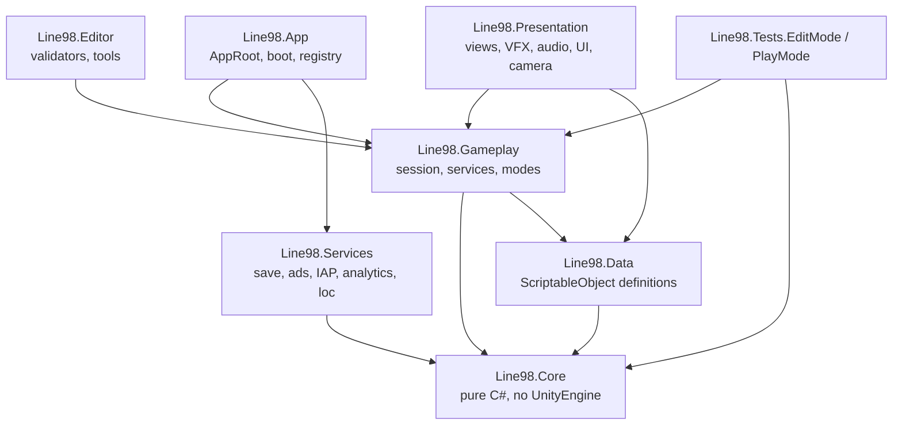
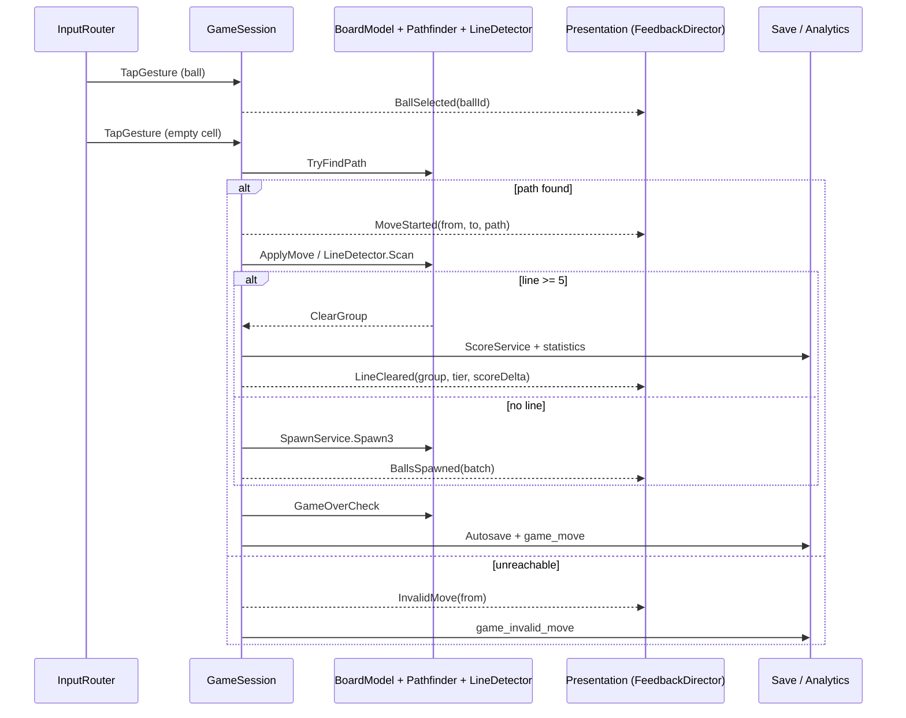

## 1. Concept vocabulary contract

GDD prose term → engine vocabulary. Fix this first; every later mapping depends on it.

| GDD term | Engine term | Kind | Notes |
|---|---|---|---|
| Board, 9×9, 81 cells | `BoardModel` (domain) / `BoardView` (presentation) | class / MB | Model never knows about transforms |
| Cell | `GridPos` (x,y bytes) → `CellIndex` = `y*9+x` (0..80) | readonly struct / int | Int index is the hot-path representation |
| Ball | `BallColor` (data), `BallView` (pooled MB), `BallId` (uint) | enum / MB / handle | Never let a GameObject be the source of truth |
| Line | `LineRun` + `ClearGroup` | struct / readonly struct | `ClearGroup` = deduped union of all runs |
| Move | `MoveRequest` → `MoveResult` | struct | Outcome enum: `Invalid, Moved, Cleared, GameOver` |
| Spawn | `SpawnBatch` (≤3) | struct | Emitted by `SpawnService` only |
| Next 3 balls | `PreviewQueue` | ring buffer | Saved verbatim (§23) |
| Run / session | `GameSession` | class | One playthrough; holds snapshot for undo |
| Tap | `TapGesture` (`PointerDown`+`PointerUp` <250 ms, <24 dp travel) | Input System action | Tap-tap only in V1; drag-to-move behind a flag |

---

## 2. Layer → GDD mapping (the architectural spine)



Dependency arrows are read as "depends on". Gameplay must **never** reference Presentation — GDD §25 "clean separation of gameplay and presentation" is enforced mechanically by asmdefs, not by convention.

| Layer | GDD sections it satisfies | Contents |
|---|---|---|
| `Line98.Core` | §2, §5, §6, §7, §25, §26 | `BoardModel`, `Pathfinder.Bfs`, `LineDetector`, `ScoreEvaluator`, `XorShift128`, `GameSnapshot`, `SpawnPolicy` |
| `Line98.Data` | §7, §8, §10, §16, §17, §19 | All `*SO` assets; contains enums only, no logic |
| `Line98.Gameplay` | §2, §3, §12, §13, §14, §15, §31 | `GameSession`, `MoveResolver`, `UndoService`, `HintService`, `Classic/Daily/ZenModeStrategy`, `FeedbackDirector`, `ReviveService` |
| `Line98.App` | §4, §22, §23, §36 | `AppRoot` (composition root), `ServiceRegistry`, boot/scene flow, no-op offline fallbacks |
| `Line98.Presentation` | §8, §9, §10, §11, §19, §20 | `BoardView`, `BallView`, `MoveAnimator`, `VfxService`, `AudioService`, `CameraRig`, `UIRouter`, screens |
| `Line98.Services` | §18, §21, §22, §23, §24, §28 | `SaveService`, `StatisticsService`, `AchievementService`, `CosmeticService`, `IAdService`, `IIapService`, `IAnalyticsService`, `LocalizationService` |

---

## 3. Master traceability table (all 36 GDD sections)

| § | GDD requirement | Unity concept | Concrete artifact |
|---:|---|---|---|
| 1 | Product framing, ads+IAP, portrait, Android-first | Project settings + brand config | `ProjectSettings` (Portrait, IL2CPP/ARM64, ASTC), `BrandConfigSO` |
| 2 | 9×9, 7 colors, tap-move, 5+ lines, spawn 3, game over | Domain simulation, no MonoBehaviours | `BoardModel`, `MoveResolver`, `LineDetector`, `SpawnService`, `GameSession` |
| 3 | Classic / Daily / Zen | Strategy pattern per mode | `IGameModeStrategy` + `ClassicMode`, `DailyChallengeMode`, `ZenMode`, `ModeDefinitionSO` |
| 4 | Folder + class list, modular, don't over-engineer | asmdef graph + composition root | 7 asmdefs; classes named exactly as GDD §4 lists them (keep the names — traceability beats cleverness) |
| 5 | BFS, 4-dir, balls = obstacles, return path, no 3rd-party | Allocation-free BFS over 81 nodes | `Pathfinder.TryFindPath(in BoardModel, GridPos, GridPos, List<GridPos>)` |
| 6 | 4 axes, ≥5, all balls, simultaneous, no double clear | Axis scan + union set | `LineDetector.Scan(in BoardModel, GridPos origin, Span<LineRun> runs)` → `ClearGroup` |
| 7 | Score table 5→9, combo multiplier, data-driven | Lookup table asset + pure evaluator | `ScoreTableSO`, `ScoreEvaluator.Evaluate(ClearGroup, in ScoreRules)` |
| 8 | Move + clear sequences, 4 feedback tiers | Presentation-only director, event-driven | `FeedbackDirector`, `MoveAnimator`, `FeedbackProfileSO` (tier 5 / 6-7 / 8 / 9+) |
| 9 | Modern 2.5D premium casual, crystal balls, 7 hues | URP + Shader Graph + palette asset | `CrystalBall.shadergraph`, `BallThemeSO` (Crystal), `BoardThemeSO` (Classic), `ColorPaletteSO` |
| 10 | Portrait 2.5D camera, data-driven | Camera rig driven by profile asset | `CameraProfileSO` {fov, tiltX, yaw, distance, padding, parallax}, `CameraRig` |
| 11 | Top HUD / center board / bottom queue+undo+hint; menu list | uGUI + TMP, safe-area aware | `HudScreen`, `MainMenuScreen`, `UIRouter`, `SafeAreaFitter`, `PreviewQueueView` |
| 12 | 3 free undos, rewarded undo, full state restore, no fake undo | Command/memento stack | `UndoService` (stack of `GameSnapshot`), `GameSnapshot` {board, score, queue, rngState, moveCount, statsDelta} |
| 13 | Hint: legal move, highlight only | BFS × candidate search, no execution | `HintService.TryFindBestMove(...)` → `HintResult { from, to, expectedScore }` |
| 14 | Continue via rewarded ad, always free New Game | Revive service + ad gate | `ReviveService.PrepareContinue()`, `ContinuePayload` {clearedCells, spawnSuppressed}, `ContinueDialog` |
| 15 | `YYYY-MM-DD-v1` seed, streak, share, provider interfaces | Deterministic seed + local persistence | `DailyChallengeService`, `IDailyChallengeProvider`, `ILeaderboardProvider`, `ShareResultFormatter` |
| 16 | Theme architecture; V1 = Crystal + 1 alt | Theme definition assets + resolver | `BallThemeSO`, `BoardThemeSO`, `ClearEffectSO`, `CosmeticService`, `ThemeResolver` |
| 17 | 10 achievements, data-driven | Definition assets + metric evaluator | `AchievementSO` {metric, threshold, key}, `AchievementService` |
| 18 | 11 tracked statistics | Counter service + DTO | `StatisticsService`, `PlayerStats` DTO, `StatsScreen` |
| 19 | 11 SFX, 2 music beds, toggles | Mixer + catalog + pooled sources | `AudioCatalogSO`, `AudioService` (2 music + N SFX sources), `MainMixer` {Master, Music, SFX, UI, Ambience}, Zen snapshot |
| 20 | 7 VFX, 60 FPS, low-end | Pooled ParticleSystems + TrailRenderer | `VfxCatalogSO`, `VfxService`, `ScorePopupView` (world-space TMP) |
| 21 | Rewarded continue/undo/hint, capped interstitial, Remove Ads IAP | Ad/IAP abstractions + scheduler | `IAdService`, `IIapService`, `InterstitialScheduler`, `AdMobAdService`, `UnityIapService` |
| 22 | Fully offline; network only for ads/leaderboard/analytics | Null-object fallbacks, no boot blocking | `ConnectivityService`, `NoOpAdService`, `NoOpAnalyticsService` |
| 23 | Save board/queue/RNG/score/mode/stats/settings/streak/daily; autosave | Versioned DTO + atomic file write | `SaveData`, `SaveService`, `SaveMigrations`, hooks on move-complete / `OnApplicationPause` / `OnApplicationQuit` |
| 24 | 19 analytics events, vendor-agnostic | Interface + event constant class | `IAnalyticsService`, `AnalyticsEvents`, `DebugAnalyticsService` |
| 25 | No warnings, no Update spam, pooling, deterministic RNG, no LINQ hot path, unit tests | Analyzers + discipline + custom RNG | `.editorconfig`, `-warnaserror` in CI, `XorShift128` with serializable state, `ObjectPool<T>` |
| 26 | Test matrix (board/path/line/score/save/daily) | Unity Test Framework | `Line98.Tests.EditMode` (8 suites), `Line98.Tests.PlayMode` (1 smoke) |
| 27 | 60 FPS, small AAB, low RAM | Build + profiling config | IL2CPP, ARM64, managed stripping High, ASTC 6×6, Addressables for themes/audio only |
| 28 | EN + VI, prepare 8 more | Unity Localization | `LocalizationService`, `ui.*` key convention, `Localization Tables` collection |
| 29 | Store copy, keywords | Non-runtime docs | `Docs/Store/StoreListing.md` (kept out of build) |
| 30 | Icon 1–3 balls, small-size readable | Art deliverable + import rules | `Art/Store/Icon_1024.png`, mip-tested at 48/72/96 |
| 31 | 20–30 s onboarding, then out of the way | Scripted seed + coach marks through real pipeline | `OnboardingDirector`, `OnboardingStepSO[]`, `TutorialSeedSO` |
| 32 | Milestones 1–5, order enforced | Build order = asmdef/folder order | M1 = Core+Gameplay+debug HUD only |
| 33 | Definition of Done | Acceptance checklist | `Docs/ReleaseChecklist.md` + PlayMode smoke test |
| 34 | Explicit non-goals | Guardrail (no such systems exist) | No `CurrencyService`, `EnergyService`, `LevelGraph`, `BackendClient` |
| 35 | "Is Line 98" + "feels modern" | Review rubric | `Docs/DesignReviewRubric.md` |
| 36 | Production sequence | This document + boot plan | See §12 |

---

## 4. Domain type inventory (load-bearing signatures)

These are the pieces the whole product hangs on. Everything else is plumbing.

```csharp
// Line98.Core — no UnityEngine references
public enum BallColor : byte { None = 0, Red, Orange, Yellow, Green, Cyan, Purple, Pink }

public readonly struct GridPos { public readonly byte X, Y; public int Index => Y * 9 + X; }

public sealed class BoardModel {
    public const int Size = 9, CellCount = 81;
    public BallColor ColorAt(GridPos p);
    public bool IsEmpty(GridPos p);
    public bool IsFull { get; }
    public int EmptyCount { get; }
    public void Set(GridPos p, BallColor c);
    public void Clear(GridPos p);
    public ulong GetOccupancyMask();       // 81 bits → 2 ulongs, for fast full/empty checks
}

public readonly struct BallData {
    public readonly BallColor Color; public readonly uint VisualId; // view binding only
}

public readonly struct MoveRequest  { public readonly GridPos From, To; public readonly uint BallId; }
public enum MoveOutcome : byte { Invalid, NoPath, Moved, Cleared, GameOver }
public readonly struct MoveResult   { public readonly MoveOutcome Outcome; public readonly ClearGroup Cleared;
                                      public readonly SpawnBatch Spawned; public readonly int ScoreDelta; }

public readonly struct LineRun      { public readonly LineAxis Axis; public readonly BallColor Color;
                                      public readonly GridPos Start; public readonly byte Length; }
public enum LineAxis : byte { Horizontal, Vertical, DiagonalAscending, DiagonalDescending }
public readonly struct ClearGroup   { /* union of runs, deduped, sorted by CellIndex */ public int Count { get; }
                                      public int LongestRun { get; } public int RunCount { get; } }

public static class Pathfinder { // BFS, 4-dir, no allocation
    public static bool TryFindPath(in BoardModel board, GridPos from, GridPos to, List<GridPos> pathOut);
}

public static class LineDetector {
    public static int Scan(in BoardModel board, GridPos origin, Span<LineRun> runsOut); // returns run count
    public static bool TryBuildClearGroup(in BoardModel board, GridPos origin, out ClearGroup group);
}

public struct XorShift128 {                 // deterministic + serializable
    public ulong S0, S1, S2, S3;            // snapshot these four for real undo (§12)
    public uint NextUInt(); public int Range(int minInclusive, int maxExclusive);
    public void SeedFrom(uint seed);
}
```

| GDD §4 class | Layer | Uses | Notes |
|---|---|---|---|
| `GameManager` | App | `AppRoot`, `UIRouter` | Scene/mode orchestration only; no puzzle logic |
| `GameState` | Core | — | `enum GamePhase { Boot, Menu, Playing, Resolving, GameOver, Paused }` — GDD's name kept, but it must not be a data bag |
| `BoardManager` | Gameplay | `BoardModel`, `BoardView` | Bridge: owns model, drives view sync |
| `BoardCell` | Presentation | — | Rounded cell view; **not** one MonoBehaviour per cell if avoidable (81 is fine, but pooling + instancing is cheaper) |
| `Ball` | Presentation | — | Pooled `BallView`; never authoritative state |
| `BallColor` | Core | — | enum above |
| `BallSpawner` | Gameplay | `SpawnService`, `PreviewQueue` | Fills preview then commits on resolve |
| `BallQueue` | Core | `XorShift128` | Ring buffer, exactly 3 visible (§2) |
| `PathfindingService` | Core | `Pathfinder` | Thin wrapper so gameplay depends on a seam |
| `LineDetectionService` | Core | `LineDetector` | Returns `ClearGroup` |
| `ScoreService` | Gameplay | `ScoreTableSO`, `ScoreEvaluator` | Owns combo + long-line bonus |
| `GameSession` | Gameplay | all of the above | Command target for undo, save, analytics |
| `DailyChallengeService` | Gameplay | `IDailyChallengeProvider` | Seed + streak + result persistence |
| `SaveService` | Services | `SaveData` | Atomic write, versioned |
| `StatisticsService` | Services | `PlayerStats` | Pure counters, event-fed |

---

## 5. Data assets (ScriptableObject map)

GDD repeatedly demands "data-driven" (§7, §10, §16, §17, §25). One asset type per tunable domain:

| Asset | Fields (essentials) | GDD refs |
|---|---|---|
| `GameConfigSO` | boardSize, spawnCount=3, previewCount=3, freeUndoCount=3 | §2, §12 |
| `ScoreTableSO` | `int[] byLength` (index 5..9 → 100/180/300/500/800), `float comboStep` | §7 |
| `SpawnColorPolicySO` | `startActiveColors`, `addColorEveryNLines`, `weights[]` | §2 (see gap #3) |
| `FeedbackProfileSO` | per tier: shakeAmp, particleBurst, audioKey, animationScale, holdMs | §8 |
| `BallThemeSO` | 7 `Color`, `Material`, pattern mask, rim intensity | §9, §16 |
| `BoardThemeSO` | cell material, frame mesh, bg gradient, shadow intensity | §9, §16 |
| `ClearEffectSO` | prefab key, pool size, tint source | §16, §20 |
| `CameraProfileSO` | fov, tiltX, yaw, distance, padding, parallax | §10 |
| `AchievementSO` | id, `AchievementMetric`, threshold, locKey, icon | §17 |
| `AudioCatalogSO` | key → clip, bus, volume, pitch variance | §19 |
| `VfxCatalogSO` | key → pooled prefab, lifetime, budget | §20 |
| `ModeDefinitionSO` | mode id, scoring on/off, ads on/off, undo allowed, seed policy | §3 |
| `DailyChallengeConfigSO` | seedFormat `"{0:yyyy-MM-dd}-v1"`, streakWindowHours, startLayout | §15 |
| `LocalizationTable` (package) | `ui.*`, `ach.*`, `stat.*` keys | §28 |

---

## 6. Interfaces (only where swapping is real)

GDD §4 says "do not over-engineer", so interfaces exist **only** at vendor/backend seams:

```csharp
IAnalyticsService      // §24 — DebugAnalytics, FirebaseAnalytics, NoOpAnalytics
IAdService             // §21 — Rewarded + Interstitial, AdMob/LevelPlay adapter
IIapService            // §21 — Remove Ads, Unity IAP adapter, stub for editor
IDailyChallengeProvider // §15 — local date provider, future server provider
ILeaderboardProvider   // §15 — NullLeaderboard v1
ISaveBackend           // §23 — file backend (tests use in-memory)
ILocalizationService   // §28 — wraps Unity Localization
IAdGate                // §14/§21 — per-feature reward gates
```

Everything else (`UndoService`, `ScoreService`, `HintService`, `CameraRig`, `BoardView`) stays a concrete class or MonoBehaviour with `[SerializeField]` refs. Interfaces on every class is the over-engineering the GDD warns against.

---

## 7. Runtime flow mapping (§2 → events)



Resolve order is fixed and non-negotiable: **validate → animate → mutate → detect → score → spawn → game-over check → autosave**. Presentation is a subscriber at every arrow; it may delay the *visual* but never the *model*. Score popup, VFX and audio are fired from `FeedbackDirector` off `MoveResult`, not from gameplay code.

---

## 8. Feature → implementation mapping (the risky ones)

| Feature | Design | Why |
|---|---|---|
| **Pathfinding (§5)** | `Pathfinder` BFS with `int[81]` queue + `int[81]` parent + `ulong[2]` visited, all pre-allocated statics. Reconstruct path by walking parents, then reverse. | 81 nodes: sub-microsecond. Zero GC per query. No third-party. |
| **Line detection (§6)** | `LineDetector.Scan` walks 4 axes from the placed ball, counting both directions, collecting cells into a `Span<LineRun>(stackalloc, 4)`. `TryBuildClearGroup` unions runs into a `HashSet`-free `ulong[2]` occupancy mask → sorted indices. | Guarantees "no duplicate clearing" structurally, not by checks. Handles L-long/9-length/multi-line naturally. |
| **Scoring (§7)** | Length → base table (5:100 … 9:800); multi-line: `total * (1 + comboStep * (runCount - 1))`. Longest-line relief applies to the best run only. | No double-count from overlapping axes; `runCount` uses distinct runs, not overlapping cells. |
| **Undo (§12)** | Before any mutation, `GameSession` pushes a `GameSnapshot` (board 81-byte array, score, queue contents, 4×ulong RNG state, move count, stat deltas). No "undo animation" — it re-applies the snapshot and re-syncs views. | RNG state in the snapshot is what makes it a *real* undo (§12 explicitly forbids visual-only). |
| **Determinism (§25, §15)** | `XorShift128` everywhere instead of `UnityEngine.Random`. Seed derives from the mode: Classic = time+run id, Daily = hash(`YYYY-MM-DD-v1`), Zen = fixed. | Same date ⇒ same challenge for all players, and undo can rewind RNG. |
| **Game feel (§8)** | `FeedbackDirector` maps (`lineLength`, `runCount`, `isPerfect`) → tier asset → queued presentation steps. It owns sequencing and the input lock during resolution. | Keeps §25 separation intact and makes tiers tunable without code. |
| **Feedback tiers (§8)** | 5 = standard clear; 6–7 = `animationScale 1.25` + shake; 8 = major payoff (screen dim + burst + slow settle); 9+ = "PERFECT LINE" banner + unique fanfare + longer hold. | Longer lines visibly out-pay shorter ones — the whole reward loop. |
| **Continue (§14)** | `ReviveService` computes a deterministic escape: remove N lowest-value balls → free ≥3 cells → grant 1 move. `ContinuePayload` is applied through the same move pipeline. | Continue is a board edit, not a state hack; game-over check re-runs after it. |
| **Hint (§13)** | For each ball: BFS its free region once → candidate cells that are empty. For each candidate, simulate placement + `LineDetector` → rank by resulting score, else by "increases max reachable free area". Cheap at 81 cells. | Finds a *useful* move, not just a legal one. Never auto-executes. GDD allows V1.1 deferral — the seam is `IGameModeStrategy.AllowsHint`. |
| **Daily (§15)** | `seed = Fnv1a32($"{localDate:yyyy-MM-dd}-v1")` → RNG → starting layout + full spawn sequence. Streak stored as `{lastCompletedDate, current, longest}`; consecutive-day check with 1-day grace. | Fully offline, zero backend, ready for a provider swap. |
| **Onboarding (§31)** | `OnboardingDirector` runs 6 scripted steps on a hand-authored seed, executed through the real `GameSession` (so nothing can drift out of sync with the real game). Highlight = pulse on source, ghost path arrow, then hand over control. | 20–30 s target; uses the shipping pipeline, so it can't lie to the player. |
| **Monetization (§21)** | `InterstitialScheduler` with: not in first session, ≥150 s since last, never inside `Resolving`, never within 2 moves of a clear, only on `GameOver→NewGame` or menu transitions. Rewarded flows are retry-safe and reward on `OnUserEarnedReward` only. | Every GDD interstitial rule becomes a single boolean gate in one class — auditable. |
| **Analytics (§24)** | `AnalyticsEvents` static class of const strings (exact GDD names) + `IAnalyticsService.Track(name, params)`. Emitters live in `GameSession`, `UndoService`, `HintService`, `ReviveService`, `CosmeticService`, `IapService`. | No vendor symbol ever appears in gameplay code (§24). |

### Analytics event → emit site

| GDD event | Emitted by |
|---|---|
| `game_start`, `game_resume` | `GameManager.EnterGame(mode)`; resume path from `SaveService` |
| `game_move`, `game_invalid_move` | `GameSession.ExecuteMove` on each `MoveOutcome` |
| `line_clear`, `long_line`, `combo` | `ScoreService` after `ClearGroup` (long_line = ≥7, combo = runCount ≥2) |
| `game_over` | `GameSession` when `GameOverCheck` trips |
| `continue_offer`, `continue_ad_started/completed` | `ReviveService` + `AdService` callback |
| `undo_used`, `hint_used` | `UndoService`, `HintService` |
| `daily_start`, `daily_complete`, `zen_start` | `DailyChallengeMode`, `ZenMode` |
| `theme_selected`, `remove_ads_purchase` | `CosmeticService`, `IapService` |

---

## 9. Presentation mapping (art / audio / VFX / UI / camera)

| GDD § | Concept | Implementation | Budget |
|---|---|---|---|
| 9 | Crystal/gem balls | URP + `CrystalBall.shadergraph`: base albedo × fresnel rim + specular + subtle inner refraction mask; 1 mesh, 7 tints via `MaterialPropertyBlock` (GPU instancing), ASTC 6×6 masks | 1–2 draw calls for all 81 balls |
| 9 | Board | Rounded-box cell mesh + SDF-rounded board shader; blob shadow decal under each ball instead of realtime shadows | 1 draw call board, 1 instanced shadow |
| 9 | Readability | 7 hues at equal luminance spacing + per-color pattern id (dot/stripe/gem-cut) as an accessibility option | — |
| 10 | 2.5D camera | `CameraRig` applies `CameraProfileSO` (fov ~28, tiltX ~58°, small yaw, distance), `BoardFitSolver` derives cell pitch from viewport so 9×9 always fits 9:16 → 9:22 | Perspective + Orbit-free, no distortion at edges |
| 11 | UI | uGUI + TMP, reference 1080×1920, `SafeAreaFitter` on HUD/root, 3 canvases (static HUD / dynamic score / popups) to avoid full-canvas rebuilds | ≤5 draw calls UI |
| 19 | Audio | `AudioService` with 2 music sources + 1 SFX source per simultaneous sound (pool), `MainMixer` groups, Zen snapshot (no ducking, ambience bus), toggles persisted | ≤8 voices |
| 20 | VFX | Pooled `ParticleSystem` prefabs (no VFX Graph — needs compute, hurts low-end Android): select glow, place pulse, line burst, combo ring, game-over; `TrailRenderer` per moving ball only; score popup = world-space TMP with DOT-less coroutine tween | ≤4 concurrent bursts, 0 alloc/frame |
| 30 | Icon | 3 crystal balls (red/green/cyan) on a subtle 3×3 grid, top-left lit, no text; exported 1024 → validated at 48/72/96 px | — |

**Camera decision:** a slight perspective tilt reads as "premium 2.5D" but costs arcade precision. Compromise: tilt is visual only — the input raycast and `GridPos` mapping are computed on the board plane, so gameplay is exactly as precise as a flat top-down grid while *looking* 2.5D.

---

## 10. Save, autosave and offline mapping (§22, §23)

```csharp
[Serializable] public sealed class SaveData {
    public int version = 1;                 // migration gate
    public SessionSave session;             // board[81], selected, queue[3], rng{4×ulong}, score, moves, modeId, phase
    public StatsSave stats;                 // §18 fields
    public ProgressSave progress;           // achievements, themes owned/selected
    public SettingsSave settings;           // music, sfx, locale, patterns-on
    public DailySave daily;                 // lastCompletedDate, streak, longestStreak, lastResult
    public int freeUndosRemaining;          // §12
}
```

- Write path: serialize to `save.tmp` → `File.Replace(tmp, save.json, save.bak)`. Crash-safe; a corrupt file loads the `.bak`.
- Hooks: `MoveResult` reaching `Moved|Cleared` (i.e. after resolve completes, never mid-animation), `OnApplicationPause(true)`, `OnApplicationFocus(false)`, `OnApplicationQuit`.
- Offline: `AppRoot` resolves each network service to a `NoOp*` implementation when unavailable; **no network call is ever awaited on the boot or gameplay path** (§22, §33 "app remains playable offline").
- Format: `Newtonsoft.Json` (`com.unity.nuget.newtonsoft-json`) rather than `JsonUtility` — dictionaries, versioned migrations, and null handling all matter here.

---

## 11. Test mapping (§26 → suites)

| GDD test group | Suite (EditMode unless noted) | Key cases |
|---|---|---|
| Board | `BoardModelTests` | add/remove, `IsEmpty`, `IsFull`, `EmptyCount`, bounds guards |
| Pathfinding | `PathfinderTests` | direct, blocked, multiple obstacles, unreachable, corners, path hugging walls, no-alloc assertion |
| Line detection | `LineDetectorTests` | H, V, both diagonals, exactly 5, 6, 7+, cross, multiple simultaneous, edge/corner, no duplicate cells |
| Scoring | `ScoreServiceTests` | each table row, combo multiplier, mixed-length multi-run, longest-line relief |
| Spawn | `SpawnServiceTests` | determinism (same seed ⇒ same batch), only empty cells, <3 empty cells behavior |
| Undo | `UndoServiceTests` | full restore incl. RNG state, queue, stats, score, moves; snapshot stack depth |
| Save/Load | `SaveServiceTests` | round-trip board/score/queue/RNG/stats; corrupt file → `.bak`; version migration |
| Daily | `DailyChallengeServiceTests` | same date ⇒ same seed, different date ⇒ different seed, streak transitions, timezone/DST edges |
| Achievements | `AchievementServiceTests` | each of the 10 unlocks once, persists, no duplicate fire |
| Flow (PlayMode) | `SmokeTests` | Boot → Classic → valid move → clear → spawn → game over → continue → new game |

CI gate per §25: `-warnaserror`, EditMode suite, one PlayMode smoke, IL2CPP Android build size check.

---

## 12. Milestone → deliverable mapping (§32)

| Milestone | Produces | Gate to pass before next |
|---|---|---|
| **M1 Playable Core** | `Line98.Core` + `Line98.Gameplay` + debug HUD (IMGUI is fine), `Boot`/`Game` scenes, no art | All EditMode tests green; a full game is playable with primitives |
| **M2 Game Feel** | `Line98.Presentation`: board/ball views, `FeedbackDirector`, VFX, audio, camera profile, first-pass URP materials | 60 FPS on low-end target; feel matches §8 sequence |
| **M3 Product Layer** | `SaveService`, `StatisticsService`, `UndoService`, `HintService`, `DailyChallengeService`, Zen, achievements, main menu, settings | Relaunch mid-game and resume identically; streak works offline |
| **M4 Monetization** | Ad/IAP adapters + `InterstitialScheduler`, continue flow, remove-ads | Interstitial rules provably respected (log-based test) |
| **M5 Polish** | Onboarding, EN/VI localization, icon, store screenshots, performance pass, consent flow | §33 Definition of Done checklist fully ticked |

Folder/asmdef creation order follows this exactly — GDD §32 "Do not start Milestone 3 before Milestone 1 is stable" becomes a repo rule: no `Line98.Services` code exists until `Line98.Core` tests pass in CI.

---

## 13. Non-goals → architectural guardrails (§34)

| Non-goal | Guardrail |
|---|---|
| Energy, Lives, Coins, Gems, Battle Pass | No `CurrencyService`, `EnergyService`, `Wallet`, or `ProgressionService` classes may be created. Ads/IAP are the only sinks. |
| 1,000 levels, campaign, RPG progression | No `LevelGraph`, `LevelCatalog`, `CharacterStats`. `ModeDefinitionSO` has exactly 3 entries. |
| Backend, multiplayer, realtime | Only `IDailyChallengeProvider` / `ILeaderboardProvider` interfaces may cross the network boundary, and both default to local/null. |
| Heavy asset-store dependencies | Add only: URP, Input System, Localization, Test Framework, Newtonsoft JSON, Unity IAP, one ad SDK. Tweening, pooling, state machines, DI are hand-rolled (~300 LOC total) rather than imported. |

---

## 14. GDD gaps and proposed defaults

The GDD is unusually complete, but these 12 points will force a decision during M1–M3. Proposed defaults are production-safe; approve or override.

| # | Ambiguity | Proposed default |
|---|---|---|
| 1 | §2 "Game ends when no valid empty cells remain" — is it *board full*, or *spawn cannot fit 3*? | Game over when a spawn batch cannot be placed at all, **or** no ball has a legal move. Checked after resolve, before autosave. |
| 2 | §2 spawn when only 1–2 empty cells remain | Spawn as many as fit; if 0 fit, game over. Never partial-fill silently — show the shortfall in the preview. |
| 3 | §2 "colors selected from the configured 7-color palette" — all 7 from move 1 is brutal | `SpawnColorPolicySO`: start with 5 active colors, introduce 6th after 10 lines, 7th after 25 lines. Toggleable. This single knob is the biggest difficulty/retention lever in the game. |
| 4 | §7 "small combo multiplier" value | `1 + 0.25 × (runCount − 1)`, capped at ×2.0. Data-driven via `ScoreTableSO.comboStep`. |
| 5 | §6 overlapping runs (a cross of two 5s shares one ball) | Award each *distinct run's* base score; do not award the shared cell twice, do not merge runs into one 9-length run. |
| 6 | §12 "3 free undo actions per session" — app session or game run? | Per game run. Undo beyond that: rewarded ad, max 3 per run. |
| 7 | §12 + §15 — does Daily allow undo if it must stay comparable? | Undo **disabled** in Daily (fairness of a shared seed). Hint stays allowed. |
| 8 | §3 Zen — does it end? | Endless with the same game-over rule, score hidden, no ads, no undo limit, separate ambience bus, does not write to Statistics best-score. |
| 9 | §21 interstitial placement | Only on `GameOver → New Game` transitions and menu returns; minimum 150 s; never within the first session's first 3 games. |
| 10 | §15 "shareable result" on Android | V1: emoji-grid text → clipboard via `GUIUtility.systemCopyBuffer`. Native share sheet in V1.1. |
| 11 | §9 7-color readability for color-vision deficiency | Ship a "Pattern hints" accessibility toggle (per-color shape overlay). Cheap, uses the theme's pattern mask. |
| 12 | §10 "camera settings data-driven" scope | Exactly the 6 fields in `CameraProfileSO`; board fit is solved procedurally, not authored per device. |
