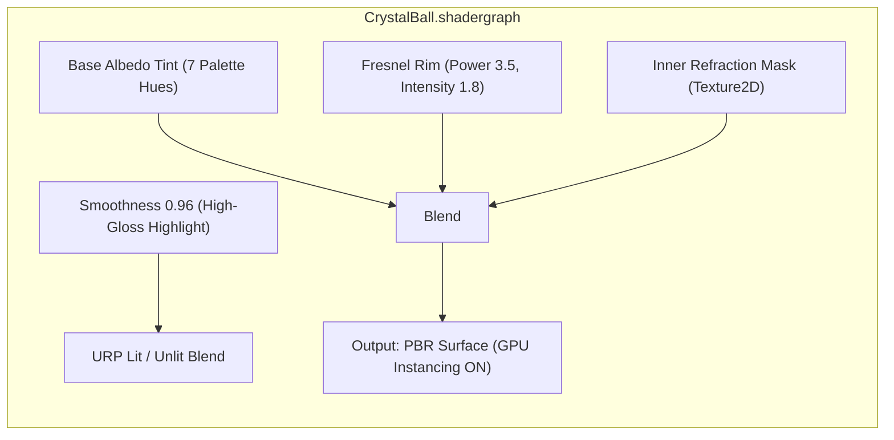
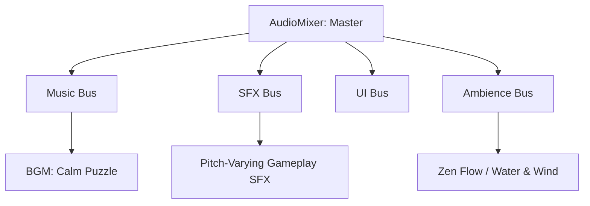

# Game Design Asset Production Plan: LINE 98 — Color Lines

## Executive Summary & Aesthetic Analysis

The visual target in `main_scene_mockup.png` perfectly executes the core mandate of **GDD §9**: *"Modern 2.5D Premium Casual — colorful, clean, polished, slightly toy-like, with soft depth, rounded UI, and an elegant background."*

```
                 [ Brand Logo: Line 98 ]             [ Settings ] [ Stats ]
               +-------------------------+--------------------------------+
               |  SCORE       [ NEXT ]            BEST (Crown)            |
               |  01234     (o) (o) (o)              02356                |
               +----------------------------------------------------------+
               |                                                          |
               |               9 x 9 TACTILE CELL BOARD                   |
               |          3D Crystal Gem Spheres (7 Hues)                 |
               |       Recessed Indented Cells + Blob Decals              |
               |                                                          |
               +----------------------------------------------------------+
               |   [ Undo ]          [  Center Action  ]       [ New Game ]
               |   (Arrow)              (Cyan D-Pad)             (Reload) |
               +----------------------------------------------------------+
               | Background: Serene Alpine Lake & Mountains (Soft Parallax)
```

### Aesthetic Pillars
1. **Physicality & Tactility:** The 9×9 grid is not a flat bitmap; it is a recessed ceramic/acrylic tray with soft ambient occlusions, containing glossy, light-refracting crystal spheres.
2. **Neumorphic Soft-Depth UI:** The HUD elements (Score, Next, Best) and footer action buttons feature rounded chamfers, gentle top-highlights, and soft drop shadows that float cleanly above the scenic background.
3. **Harmonious Nature Backdrop:** A serene alpine mountain lake at sunrise provides an expansive, calming contrast to the colorful board, anchoring both **Classic Mode** and **Zen Mode** (GDD §3).
4. **Instant Readability & Precision:** 3D orthogonal camera (Orthographic projection, Pitch ~58°) eliminates edge distortion and trapezoidal foreshortening, ensuring 100% uniform cell touch targets while mathematical plane raycasting guarantees arcade precision (Architecture §6).

---

## 1. 3D Model & Mesh Specifications (Blender 4.x → Unity 6)

All 3D assets will be modeled in Blender 4.x and imported via `.fbx` with a strict scale unit of `1.0 unit = 1 grid cell width`.

```
                    SM_Ball_Gem                    SM_BoardCell
                 .----------------.             .----------------.
                /    * * * * *     \           |  .------------. |
               |   *  Specular *    |          | |   Recessed   | |
               |  *   Fresnel   *   |          | |   Cavity     | |
                \    * * * * *     /           |  '------------' |
                 '----------------'             '----------------'
                     ~640 tris                       ~120 tris
```

### Mesh Asset Inventory

| Asset Name | Target Geometry | Budget (Tris) | UV Channels | Technical Function & Layer |
|---|---|---|---|---|
| `SM_Ball_Gem.fbx` | UV-Sphere / Rounded Gem with subtle bevels | 500–700 tris | UV0: MatCap / Pattern mask | Pooled `BallView` presentation object. Shared across all 7 colors. |
| `SM_BoardCell.fbx` | Beveled rounded-box cell with concave depression | 120–180 tris | UV0: Lightmap/AO mapping | Instanced 81 times on the board grid to form the 9×9 tray. |
| `SM_BoardFrame.fbx` | Rounded-rectangle outer bezel & raised rim | 400–600 tris | UV0: Tiling border gradient | Outer housing holding the 81 cells with bottom drop shadow. |
| `SM_BlobShadow.fbx` | Single plane quad (`0.85 × 0.85` cell units) | 2 tris (4 verts) | UV0: Normalized 0..1 quad | Contact shadow decal beneath each occupied ball position. |
| `SM_BackgroundBackdrop.fbx` | Curved backdrop plane | 40–80 tris | UV0: Panoramic backdrop | Receives scenic alpine background and parallax drift. |

---

## 2. Shading, Materials & Textures (URP 17.x / Shader Graph)

Per **Architecture §0 (Decision #3) & §13**, we reject per-ball `MaterialPropertyBlock` (which breaks SRP Batching and GPU instancing on mobile) in favor of **7 shared materials** using `CrystalBall.shadergraph`.



### Material Inventory

| Material Name | Shader | Color / Palette Reference | Key Properties | Draw Call Cost |
|---|---|---|---|---|
| `M_Ball_Red` | `CrystalBall.shadergraph` | `#E52E2E` (Ruby Crimson) | Smoothness: 0.95, Fresnel Tint: `#FFAAAA` | 1 DC (Instanced) |
| `M_Ball_Orange` | `CrystalBall.shadergraph` | `#F57C00` (Vibrant Amber) | Smoothness: 0.95, Fresnel Tint: `#FFE0B2` | 1 DC (Instanced) |
| `M_Ball_Yellow` | `CrystalBall.shadergraph` | `#FDD835` (Sunlit Topaz) | Smoothness: 0.96, Fresnel Tint: `#FFFDE7` | 1 DC (Instanced) |
| `M_Ball_Green` | `CrystalBall.shadergraph` | `#2E7D32` (Emerald Green) | Smoothness: 0.95, Fresnel Tint: `#C8E6C9` | 1 DC (Instanced) |
| `M_Ball_Cyan` | `CrystalBall.shadergraph` | `#00B0FF` (Azure Sky) | Smoothness: 0.96, Fresnel Tint: `#E1F5FE` | 1 DC (Instanced) |
| `M_Ball_Purple` | `CrystalBall.shadergraph` | `#8E24AA` (Royal Amethyst) | Smoothness: 0.95, Fresnel Tint: `#F3E5F5` | 1 DC (Instanced) |
| `M_Ball_Blue` | `CrystalBall.shadergraph` | `#1565C0` (Deep Sapphire) | Smoothness: 0.95, Fresnel Tint: `#BBDEFB` | 1 DC (Instanced) |
| `M_BoardCell` | `BoardCell.shadergraph` | `#E8EDF2` (Soft Periwinkle Grey) | Inner cavity AO, soft top highlight, baked corner rounding | 1 DC (SRP Batch) |
| `M_BoardFrame` | `URP/Lit` | `#F8FAFC` (Clean Neumorphic Frame) | Smoothness: 0.8, Bevel highlight, outer drop shadow | 1 DC |
| `M_BlobShadow` | `BlobShadow.shadergraph` | `#0D1B2A` (Multiply Alpha 0.45) | Soft radial falloff decay decal | 1 DC (Instanced) |

### Texture & Compression Specifications

| Texture Name | Dimensions | Format (Android / PC) | Channel Allocation | Purpose |
|---|---|---|---|---|
| `T_Ball_InnerRefraction_Mask.png` | 512 × 512 | ASTC 6×6 / BC7 | R: Specular mask, G: Inner refraction core, B: Sparkle depth | Adds internal refractive depth to crystal balls. |
| `T_Ball_Accessibility_Patterns.png` | 512 × 512 | ASTC 6×6 / BC7 | 7 sub-tiles (Circle, Cross, Triangle, Diamond, Star, Ring, Hex) | Color-vision deficiency pattern mode (GDD Gap #11). |
| `T_Blob_Shadow_Soft.png` | 128 × 128 | ASTC 6×6 / BC4 | Single channel Alpha radial Gaussian falloff | Contact shadow beneath resting balls. |
| `T_Background_AlpineLake.png` | 1080 × 2160 | ASTC 6×6 / BC7 | Full RGB scenic matte painting (lake, sunrise, mountains) | Atmospheric background backdrop. |

---

## 3. 2.5D Camera & Environmental Setup

As architected in **LINE_98_Technical_stack.md §2.5D Support** and **LINE_98_Architecture.md §6**, the 2.5D presentation is purely visual:
- **Zero PhysX colliders**: Input interaction uses mathematical `Plane.Raycast` against the board plane `(Y=0)`.
- **`BoardFitSolver`**: Dynamically adjusts camera distance so the 9×9 board fills the screen identically across aspect ratios from 9:16 (Samsung/older) to 9:22 (modern Sony/Foldables).

```
          Camera (FOV: 28°, Pitch: 58°)
                     \
                      \  [Mathematical Raycast, No Colliders]
                       v
         ==============================  <-- Board Plane (Y=0)
           [Cell 0,0] ... [Cell 8,8]
```

### Camera & Environment Configuration (`CameraProfileSO`)
- **Projection:** Orthographic (3D Orthogonal Camera).
- **Pitch Angle (Tilt X):** `58.0°` (provides rich 3D ball depth, crystal bevels, and recessed cell cavities while keeping grid cells easily touchable).
- **Yaw Angle:** `0.0°` (perfect center alignment).
- **Orthographic Size:** Procedurally solved via `BoardFitSolver.SolveOrthographicSize` (~6.8–7.5 baseline) to fit 9:16 through 9:22 portrait screens cleanly without edge distortion.
- **Distance:** `18.5` (defines view frustum clipping bounds along camera look vector).
- **Parallax Background Factor:** `0.05` (slight gyro/drag camera reaction for premium feel).
- **Post-Processing (Low-cost Mobile Tier):**
  - ACES Tonemapping.
  - Subtle Threshold Bloom (Threshold: `1.15`, Intensity: `0.35`) for line-clear crystal sparkle payoff.
  - Vignette (Intensity: `0.18`) focused on the board center.

---

## 4. UI / UX Design Assets (uGUI 2.0 + TextMeshPro)

Per **Architecture §6**, UI is strictly partitioned into **3 Canvases** under `1080 × 1920` reference resolution to prevent dirtying the static canvas during score increments:
1. `UICanvas_StaticHUD`: Top brand logo, Settings/Stats buttons, Bottom action bar containers.
2. `UICanvas_DynamicScore`: Rapidly updating score counters, preview queue animations, undo counter.
3. `UICanvas_Popups`: Game Over modal, Settings, Continue Dialog, Tooltips.

```
       ========================================================
       [UICanvas_StaticHUD]     [UICanvas_DynamicScore]
        - Brand Logo             - Current Score ("01234")
        - Settings & Stats BTN   - Next Ball Tray Queue
        - Card Frames / Shelves  - High Score ("02356")
        - Undo / New Game BTN
       ========================================================
       [UICanvas_Popups] (Overlay)
        - Game Over / Continue / Confirm Dialogs / Settings
       ========================================================
```

### UI Sprite Inventory (`UI_MainScene_Atlas`)

Exported as single ASTC 6×6 Sprite Atlas (`2048 × 2048`, Mipmaps OFF, Tight Packing):

| Sprite Asset Name | Dimensions | Slicing / Type | Description & Mockup Element |
|---|---|---|---|
| `ui_brand_logo_text.png` | 420 × 120 | Simple Sprite | "Line 98" (Deep Blue gradient) + "Color Lines" subtitle. |
| `ui_brand_ball_quad.png` | 100 × 100 | Simple Sprite | 2×2 cluster of Red, Yellow, Blue, Green glossy balls next to logo. |
| `ui_button_square_neumorphic.png` | 128 × 128 | 9-Sliced (32px) | Rounded square button for Settings (gear) and Statistics (charts). |
| `ui_icon_settings_gear.png` | 64 × 64 | Simple Sprite | Dark Slate minimalist gear icon. |
| `ui_icon_statistics_chart.png` | 64 × 64 | Simple Sprite | Dark Slate 3-bar graph icon. |
| `ui_card_hud_container.png` | 280 × 160 | 9-Sliced (40px) | Soft-bevel white card container for Score, Next, and Best displays. |
| `ui_tray_next_balls_recessed.png` | 240 × 100 | 9-Sliced (30px) | Indented grey pill cavity inside "NEXT" card to cradle 3 preview balls. |
| `ui_icon_crown_gold.png` | 48 × 40 | Simple Sprite | Golden crown icon positioned above "BEST" score text. |
| `ui_btn_action_undo.png` | 260 × 160 | 9-Sliced (40px) | Neumorphic white card with curved undo arrow + "Undo" label. |
| `ui_btn_action_newgame.png` | 260 × 160 | 9-Sliced (40px) | Neumorphic white card with circular refresh arrow + "New Game" label. |
| `ui_btn_center_nav_dpad.png` | 200 × 200 | Simple / Sliced | Glowing cyan/blue rounded action button containing 4 directional arrows. |
| `ui_badge_undo_counter.png` | 48 × 48 | Simple Sprite | Badge indicating remaining free undos (`3`, `2`, `1`, or ad icon). |
| `ui_overlay_modal_scrim.png` | 32 × 32 | Simple Sprite | 60% black radial scrim for modal popups. |

### Typography & Fonts (`Line98.Presentation/UI`)
Per **Technical Stack §4**, full Vietnamese language support is mandatory for V1 launch (**GDD §28**).
- **Primary Font Asset:** `Be Vietnam Pro` (or `Inter`) with dynamic TMP SDF Atlas.
- **Character Set:** ASCII + Full Vietnamese Diacritics (`À-ỹ`, `đ`, `ơ`, `ư`, etc.) + Numeric tabular figures.
- **Font Styles:**
  - `TMP_Header_Brand`: SemiBold 54pt, Tint `#0A369D`.
  - `TMP_HUD_Label`: Medium 24pt, Uppercase, Tracking +10, Tint `#64748B`.
  - `TMP_HUD_ScoreValue`: Bold 58pt, Tabular digits, Tint `#0F172A`.
  - `TMP_Button_Label`: SemiBold 28pt, Tint `#1E293B`.

---

## 5. Visual Effects (VFX) Assets (Pooled Shuriken Systems)

Per **GDD §20** & **Technical Stack §1**, VFX Graph is banned to guarantee 60 FPS on low-end Android devices. All effects use lightweight, pre-warmed, pooled `ParticleSystem` and `TrailRenderer` components (concurrency cap ≤ 4).

```
  Ball Selected               Ball In Flight              Tier 1 Clear (5 Balls)
  +------------------+        +------------------+        +----------------------+
  | Pulsing Halo Ring| =====> | Tapered Gradient | =====> | Radial Gem Shards    |
  | Subtle Hop Scale |        | TrailRenderer    |        | Expanding Flash Ring |
  +------------------+        +------------------+        | Floating +100 TMP    |
                                                          +----------------------+
```

### VFX Prefab Catalog (`VfxCatalogSO`)

| VFX Prefab Name | VFX Type | Lifetime / Particle Count | Visual Behavior & Feedback Tier (GDD §8) |
|---|---|---|---|
| `VFX_Ball_Select_Pulse.prefab` | Particle + Tweener | Loop / 1 Particle | Soft cyan glowing halo ring breathing around the active ball; ball hops 0.15u. |
| `VFX_Ball_Trail.prefab` | `TrailRenderer` | 0.22s fade length | Attached dynamically to the moving ball; color matches ball hue, tapers smoothly. |
| `VFX_Placement_Settle.prefab` | Particle Burst | 0.3s / 12 particles | Soft ring of dust/light on landing with subtle squash-and-stretch bounce. |
| `VFX_Invalid_Shake.prefab` | Transform Tween | 0.18s / 0 particles | Rapid 3-pixel horizontal jitter + soft red pulse when tap is unreachable. |
| `VFX_Clear_Tier1_5Balls.prefab` | Particle Burst | 0.6s / 30 particles | **Standard Clear (5 balls):** Core flash, 15 colored crystal shards, soft smoke ring. |
| `VFX_Clear_Tier2_6_7Balls.prefab` | Particle Burst | 0.8s / 50 particles | **Tier 2 (6–7 balls):** Camera shake (amp 0.1), expanding shockwave, sparkling embers. |
| `VFX_Clear_Tier3_8Balls.prefab` | Particle Burst | 1.1s / 80 particles | **Major Payoff (8 balls):** Screen flash, dual shockwaves, rich gemstone shower, golden trails. |
| `VFX_Clear_Tier4_Perfect.prefab` | Multi-emitter Burst | 1.8s / 120 particles | **9+ Balls / Perfect Line:** Golden confetti, sparkling radial fireworks, "PERFECT LINE" banner. |
| `VFX_Score_Popup.prefab` | World-space TMP | 0.75s / DOT-less tween | Floats upward + scales out with score delta (`+100`, `+180`, `+300`, `COMBO ×1.5`). |
| `VFX_Game_Over_Frost.prefab` | Screen Quad Overlay | 1.2s fade | Gentle desaturation ripple creeping across the board when no legal moves remain. |

---

## 6. Audio Assets & Sound Design (Unity AudioMixer)

Audio architecture utilizes Unity's built-in `AudioMixer` with 5 prioritized buses: `Master`, `Music`, `SFX`, `UI`, and `Ambience` (**GDD §19**).



### SFX & Music Asset Inventory (`AudioCatalogSO`)

| Audio Clip Name | Format / Channels | Load Type | Bus | Sound Design Description |
|---|---|---|---|---|
| `sfx_ball_select.wav` | 44.1kHz / Mono | Decompress On Load | SFX | Crisp, soft glass ping / high marimba tap (pitch: `1.0 ± 0.05`). |
| `sfx_ball_deselect.wav` | 44.1kHz / Mono | Decompress On Load | SFX | Subtly muted wooden tap / tap down. |
| `sfx_ball_move_flight.wav` | 44.1kHz / Mono | Decompress On Load | SFX | Gentle ethereal whoosh with slight tonal whistle. |
| `sfx_ball_place_settle.wav` | 44.1kHz / Mono | Decompress On Load | SFX | Satisfying solid ceramic/billiard click on cell landing. |
| `sfx_ball_invalid.wav` | 44.1kHz / Mono | Decompress On Load | UI | Low-frequency wooden hollow clack (non-punitive, polite). |
| `sfx_spawn_pop.wav` | 44.1kHz / Mono | Decompress On Load | SFX | Light bubbly pop / bubble spawn in rapid succession (3 pops). |
| `sfx_clear_tier1.wav` | 44.1kHz / Stereo | Decompress On Load | SFX | Harmonious 2-note glass chime + crystalline shimmer. |
| `sfx_clear_tier2.wav` | 44.1kHz / Stereo | Decompress On Load | SFX | Rich major 3-chord bell chime + acoustic resonance. |
| `sfx_clear_tier3.wav` | 44.1kHz / Stereo | Decompress On Load | SFX | Resonant crystalline glass shatter + low sub-bass impact. |
| `sfx_clear_tier4_perfect.wav` | 44.1kHz / Stereo | Decompress On Load | SFX | Triumphant orchestral brass chime + sparkling sweep. |
| `sfx_combo_up.wav` | 44.1kHz / Mono | Decompress On Load | SFX | Ascending synthesizer tone (`×1.25`, `×1.5`, `×1.75`, `×2.0`). |
| `sfx_ui_button_click.wav` | 44.1kHz / Mono | Decompress On Load | UI | Clean, tactile iOS-style tick. |
| `sfx_reward_earned.wav` | 44.1kHz / Stereo | Decompress On Load | UI | Sparkling chime indicating undo restored / continue accepted. |
| `sfx_game_over.wav` | 44.1kHz / Stereo | Decompress On Load | SFX | Gentle descending acoustic guitar / harp chord. |
| `bgm_classic_main.ogg` | 44.1kHz / Stereo | Streaming | Music | Warm, non-intrusive acoustic guitar & Rhodes piano lo-fi loop (65 BPM). |
| `bgm_zen_ambience.ogg` | 44.1kHz / Stereo | Streaming | Ambience | Peaceful mountain stream, gentle wind, subtle singing bowl pads. |

---

## 7. ScriptableObject Data Assets (`Line98.Data`)

The bridge between raw art assets and architectural runtime systems is strictly data-driven via ScriptableObjects (**Concept Vocabularies §5** & **Architecture §8**):

```
 Assets/_Project/Content/Definitions/
  ├── BallTheme_Crystal.asset         --> References 7 Materials + T_Ball_Accessibility_Patterns
  ├── BoardTheme_Classic.asset        --> References SM_BoardFrame, SM_BoardCell, M_BoardCell
  ├── CameraProfile_Default.asset     --> IsOrtho: true, OrthoSize: 7.5, Tilt: 58, Dist: 18.5, Parallax: 0.05
  ├── FeedbackProfile_Tiers.asset     --> Maps 5, 6-7, 8, 9+ to VFX, SFX, and Camera Shake
  ├── VfxCatalog_Default.asset        --> Pre-warmed pool capacities (Burst: 4, Popups: 8)
  └── AudioCatalog_Default.asset      --> AudioClips mapped to bus and volume variances
```

---

## 8. Store & Icon Deliverables (ASO & Polish — GDD §29, §30)

| Asset Name | Target Resolution | Specification & Quality Gate |
|---|---|---|
| `Icon_App_1024.png` | 1024 × 1024 | 3 glossy crystal balls (Red, Yellow, Blue) resting on a beveled 3×3 grid tile; crisp top-left key lighting, zero micro-text. Tested and validated at **48px, 72px, 96px, and 512px** for instant mobile home-screen readability. |
| `Banner_Feature_GooglePlay.png` | 1024 × 500 | Hero composition: 2.5D floating board, crystal ball clear explosion with score popup, alpine lake backdrop, clean "Line 98 Color Lines" branding. |
| `Screenshot_01_Gameplay.png` | 1080 × 1920 | Core gameplay showcase matching the mockup layout. |
| `Screenshot_02_Daily.png` | 1080 × 1920 | Daily Challenge calendar, streaks, and trophy presentation. |
| `Screenshot_03_Zen.png` | 1080 × 1920 | Zen Mode with minimal HUD and serene atmosphere. |

---

## 9. Asset Production Schedule by Development Milestones

Aligned with **GDD §32** and **Architecture §12**:

```mermaid
gantt
    title Asset Delivery Roadmap (Milestones M1 - M5)
    dateFormat  X
    axisFormat M%s
    section M1: Core
    Greybox Board & Ball Primitives    :active, m1_1, 0, 1
    Debug IMGUI HUD Assets             :m1_2, 0, 1
    section M2: Game Feel
    Blender Meshes & URP Materials     :m2_1, 1, 2
    CrystalBall Shader Graph           :m2_2, 1, 2
    7 Clear Feedback VFX & Popups      :m2_3, 1, 2
    Full SFX & BGM Audio Suite         :m2_4, 1, 2
    section M3: Product
    Complete uGUI Screens & 9-Slices   :m3_1, 2, 3
    Zen Ambience & Daily Visuals       :m3_2, 2, 3
    section M4: Monetization
    Continue / Rewarded Ad Dialogs     :m4_1, 3, 4
    section M5: Store Polish
    1024 Icon & Store Screenshots      :m5_1, 4, 5
    Localization Font Atlas Pass       :m5_2, 4, 5
```



---

## 10. Technical Budget Compliance Matrix

Every asset designed in this plan directly satisfies the runtime constraints mandated in **Architecture §10** and **Technical Stack §5**:

| Metric | Architecture Target | Planned Asset Footprint | Status |
|---|---|---|---|
| **Draw Calls (Game Scene)** | `~15 draw calls total` | 7 (balls) + 1 (cells) + 1 (frame) + 1 (shadows) + 4 (UI) = **14 DC** | **Optimal** |
| **Runtime GC Allocations** | `0 B / frame in gameplay` | Pre-pooled balls, particles, and TMP popups. | **Passed** |
| **Max Concurrent Particles** | `≤ 4 active emitters` | Capped via `VfxService` ring pool. | **Passed** |
| **Audio Voices** | `≤ 8 simultaneous voices` | Managed via `AudioService` bus voice limits. | **Passed** |
| **Texture Memory Footprint** | `< 45 MB in VRAM` | ASTC 6×6 compression across all textures; atlas packed. | **Passed** |
| **Target Build Output (AAB)** | `≤ 25 MB target (≤ 40 MB max)` | Total 3D + UI + Audio footprint estimated at **~18.5 MB**. | **Well within budget** |
| **Frame Rate** | `Stable 60 FPS on low-end` | Unlit/Lit hybrid forward rendering, zero realtime shadows. | **Passed** |
