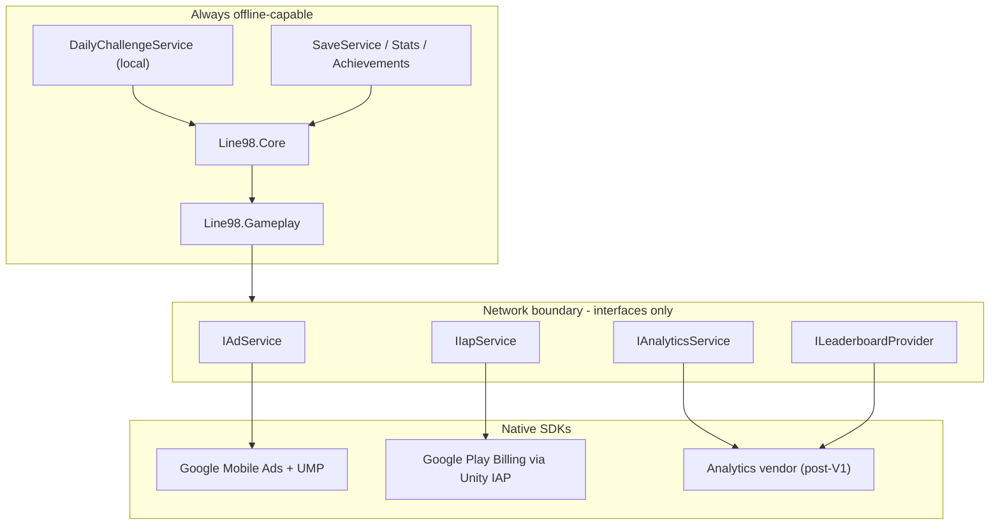

# LINE 98: Color Lines — Technical Stack & Dependencies

## 1. Stack at a glance

| Layer | Choice | Version line | GDD / vocab ref | Notes |
|---|---|---|---|---|
| Engine | **Unity 6 LTS** | `6000.0.x LTS` (pin exact patch) | §1, §36 | Pin in `ProjectSettings/ProjectVersion.txt`; never auto-upgrade mid-milestone |
| Language | C# 9 / .NET Standard 2.1 | Unity 6 default | §25, vocab §4 | `readonly struct`, `Span<T>`, `stackalloc` are load-bearing (`LineDetector`, `Pathfinder`) |
| Render pipeline | **URP** (`com.unity.render-pipelines.universal`) | 17.x (coupled to editor) | §9 | Forward, SRP Batcher ON, GPU instancing ON, no realtime shadows |
| Shading | **Shader Graph** (`CrystalBall.shadergraph`) | same as URP | §9, vocab §9 | No hand-written HLSL unless profiling demands it |
| Rendering API (Android) | **GLES3 primary, Vulkan secondary** | — | §27 | GLES3 first for low-end driver stability; revisit Vulkan at M5 with a device matrix |
| Input | **Input System** (`com.unity.inputsystem`) | 1.11+ | vocab §1 `TapGesture` | Pointer/touch only. No gamepad, no drag (drag behind a flag) |
| UI | **uGUI 2.0 + TextMeshPro** (`com.unity.ugui`) | 2.0.x | §11 | TMP ships inside uGUI in Unity 6. 3 canvases (static HUD / dynamic score / popups) |
| UI framework (rejected) | UI Toolkit runtime | — | §11 | Evaluated, rejected: pooled dynamic HUD + world-space popups fit uGUI better |
| Localization | **Unity Localization** | 1.5.x | §28 | EN + VI ship; 8 more prepared. `ui.*` / `ach.*` / `stat.*` keys |
| Save serialization | **Newtonsoft Json** (`com.unity.nuget.newtonsoft-json`) | 3.2.1 | §23, vocab §10 | `JsonUtility` rejected: dictionaries, versioned migrations, null semantics |
| Core RNG | **Hand-rolled `XorShift128`** | — | §25, vocab §8 | `UnityEngine.Random` banned in Core and Gameplay. 4×`ulong` state is part of `GameSnapshot` |
| Tween / pooling / FSM / DI | **Hand-rolled (~300 LOC)** | — | vocab §13 | No DOTween, no Zenject/VContainer, no asset-store frameworks |
| Camera | **Hand-rolled `CameraRig` + `CameraProfileSO`** | — | §10 | Cinemachine evaluated and rejected — 6 fields, one solver |
| VFX | **Pooled `ParticleSystem` + `TrailRenderer`** | — | §20 | VFX Graph rejected — needs compute, hurts low-end Android |
| Audio | **Unity Audio + `AudioMixer`** | built-in | §19 | 2 music sources + N pooled SFX. FMOD/Wwise rejected (AAB size, workflow) |
| Ads | **Google Mobile Ads (AdMob) Unity plugin** | v9/v10 line | §21 | Behind `IAdService`. LevelPlay evaluated as the alternative at M4 |
| IAP | **Unity IAP** (`com.unity.purchasing`) | 4.12+ (evaluate 5.x) | §21 | One product: Remove Ads. `IIapService` + editor stub |
| Consent | **UMP** (bundled inside the AdMob plugin) | — | §33 | Consent/privacy flow is a Definition-of-Done item |
| Analytics | `IAnalyticsService` → **Debug + NoOp for V1** | — | §22, §24 | Vendor adapter is an M4/M5 decision; never in gameplay code |
| Content delivery | **Addressables** | 2.3+ | §27 | Themes + audio **only**, local groups only (offline-first). No CCD/remote |
| Tests | **Unity Test Framework** | 1.4.x | §26 | `Line98.Tests.EditMode` (8 suites) + `Line98.Tests.PlayMode` (1 smoke) |
| CI | **GameCI on GitHub Actions** + Git LFS | — | §25, vocab §11 | `-warnaserror`, EditMode suite, PlayMode smoke, IL2CPP AAB size check |
| Profiling | Profiler + Memory Profiler package + Frame Debugger + Android GPU Inspector | — | §20, §27 | `com.unity.mobile.android-logcat` for device debugging |
| IDE | Rider (primary) or VS via `com.unity.ide.rider` | — | — | `.editorconfig` at repo root, consistent with CI gate |

---

## 2. Exact dependency list (`Packages/manifest.json`)

Additions only — everything else stays at the editor default.

```json
{
  "dependencies": {
    "com.unity.render-pipelines.universal": "17.x",
    "com.unity.ugui": "2.0.0",
    "com.unity.inputsystem": "1.11.x",
    "com.unity.localization": "1.5.x",
    "com.unity.nuget.newtonsoft-json": "3.2.1",
    "com.unity.addressables": "2.3.x",
    "com.unity.purchasing": "4.12.x",
    "com.unity.test-framework": "1.4.x",
    "com.unity.ide.rider": "3.0.x",
    "com.unity.mobile.android-logcat": "1.4.x",
    "com.unity.memoryprofiler": "1.1.x"
  }
}
```

Justification per entry, against the vocab §13 "Add only" list:

| Package | Role | Allowed by |
|---|---|---|
| URP | All rendering, Shader Graph host | §13 explicit |
| ugui (incl. TMP) | §11 UI | Built-in, not an addition |
| Input System | `TapGesture` | §13 explicit |
| Localization | §28 EN/VI | §13 explicit |
| Newtonsoft Json | §23 atomic versioned save | §13 explicit |
| Addressables | themes/audio only | §27 explicit |
| Unity IAP | Remove Ads | §13 explicit |
| Test Framework | §26 matrix | §13 explicit |
| rider / android-logcat / memoryprofiler | **Editor-only, stripped from build** | Dev tooling, zero runtime cost |

Two version notes: URP's version is bound to the editor — let Unity resolve it and commit the resulting `packages-lock.json`. Patch versions above are the target line; **verify and pin at project creation**, don't trust my patch numbers blindly.

---

## 3. Non-UPM dependencies (SDKs)

| Dependency | Ships as | Adds to build | Risk |
|---|---|---|---|
| Google Mobile Ads Unity plugin | `.unitypackage` or UPM git ref (pin the commit) | ~2–3 MB native | Google Play Services dependency; must be the *only* ad SDK |
| EDM4U (`com.google.external-dependency-manager`) | Bundled by the AdMob plugin | build tooling | Tangles with Gradle/manifest — isolate Gradle templates in the repo |
| UMP (consent) | Inside AdMob plugin | 0 extra | Required for EU consent flow (§33) |
| Analytics vendor | Firebase *or* Unity Analytics | 2–4 MB / 0 MB | **Defer.** V1 ships `DebugAnalyticsService` + `NoOpAnalyticsService` |
| Crash reporting (optional) | Firebase Crashlytics *or* Unity Cloud Diagnostics | 1–3 MB | Optional M5 gate; decide with the analytics vendor |

Boundary rule: **only these services may touch the network, and every one of them resolves to a `NoOp*` implementation when unreachable.** No network call sits on the boot or gameplay path (§22, §33).



---

## 4. Art / audio / content toolchain

| Discipline | Tool | Deliverable | Import rules |
|---|---|---|---|
| Ball + cell meshes | **Blender 4.x** | 1 UV-sphere gem (~500–800 tris), 1 rounded-box cell, frame | FBX, scale 1u = 1 cell, no animation in mesh |
| Ball look | **Shader Graph** + 1 pattern mask atlas (dot/stripe/gem-cut) | `CrystalBall.shadergraph`, tinted 7 ways | ASTC 6×6, 512px, mipmaps ON |
| Color palette | **`ColorPaletteSO` / `BallThemeSO`** | 7 hues at equal luminance spacing | Authored in-editor; this asset *is* the art spec |
| Board / background | Blender + Shader Graph (SDF rounded board) | Board mesh, bg gradient, blob-shadow decal | 1 draw call board, 1 instanced shadow |
| UI design | **Figma** | 1080×1920 reference frames, 9-slice sprites, 3 screens | Export PNG atlas, Sprite Atlas ASTC 6×6, mips OFF |
| Fonts | **Be Vietnam Pro** or **Inter** | TMP dynamic SDF + VI-diacritics subset, fallback chain | Mandatory: §28 VI ships in V1 — reject any font lacking Vietnamese coverage |
| SFX / music | **Audacity / Reaper** | 11 SFX + 2 music beds + Zen ambience | SFX: mono, Vorbis compressed-in-memory; music: streaming |
| Store art | **Figma / Affinity** | 1024 icon, screenshots | §30 icon: 3 crystal balls, no text, validated at 48/72/96/512 px |

Rejected for V1: Addressables-for-everything, remote content, DCC-to-Unity auto-import pipelines, spine/live-2D.

---

## 5. Build & platform configuration

| Setting | Android (production) | Windows x64 (development) |
|---|---|---|
| Scripting backend | **IL2CPP** | Mono (fast iteration) |
| Target arch | **ARM64 only** | x64 |
| Code generation | "Faster (smaller) builds" | default |
| Managed stripping | **High** + `link.xml` for Newtonsoft/ads | Low |
| Min / target API | min 24, target the Play-mandated level (API 35/36 — confirm in Play Console at submission) | — |
| Graphics API | GLES3 primary, Vulkan secondary, Auto off | D3D11 |
| Texture compression | **ASTC 6×6**, ETC2 fallback only if analytics prove non-ASTC devices | DXT |
| Color space | Linear | Linear |
| Orientation | Portrait, locked | free |
| Output | **AAB**, no OBB | exe |
| Lighting | Auto-generate lighting OFF, no realtime lights, no baked GI | same |
| Frame target | `Application.targetFrameRate = 60`, vSync off | vSync on |
| Splash | Unity Personal cannot disable — budget Pro if brand splash must go | — |

Perf levers, in order: no realtime shadows (blob decals already in §9), no post-FX stack beyond optional threshold bloom on mid/high tiers, render scale 1.0 with a low-tier clamp to 0.9, particle concurrency cap ≤4, zero per-frame allocation in gameplay.

AAB budget: **≤ 40 MB** hard ceiling, **≤ 25 MB** target. Audit and remove unused built-in modules (`vr`, `xr`, `subsystems`, `ai`, `terrain`, `terrainphysics`, `cloth`, `vehicles`, `wind`) — verify the editor doesn't silently re-add them via a package dependency.

---

## 6. Dependency rules enforced mechanically

| Rule | Enforcement |
|---|---|
| Gameplay never references Presentation (§25) | asmdef graph + `ArchitectureTests` that parses the 7 `.asmdef` files and asserts the allowed edge list |
| Core has zero `UnityEngine` | asmdef with `"noEngineReferences": true` on `Line98.Core` |
| No third-party pathfinding (§5) | No pathfinding package in the manifest; `Pathfinder` is hand-written BFS |
| No currency/energy/lives/level systems (§34) | Guardrail test: fail the build if a banned type name appears in `Line98.*` |
| Vendor symbols never in gameplay (§24) | `Line98.Gameplay` asmdef does not reference any ad/IAP/analytics assembly |
| `-warnaserror` (§25) | CI + a `Directory.Build.props`-equivalent via `.editorconfig` + Roslyn severity rules |

---

## 7. Deliberately excluded

Cinemachine · DOTween · VFX Graph · DOTS/ECS/Burst/Jobs · Zenject/VContainer/Extenject · Odin · FMOD/Wwise · A* Pathfinding Project · any 3D physics (input is a mathematical plane raycast, no colliders) · Unity Services (Cloud Save, Remote Config, Leaderboards) · Firebase suite in V1 · AdMob **and** LevelPlay simultaneously · LevelGraph / CurrencyService / EnergyService / Wallet / BackendClient (§34).

Each of these either duplicates ~300 LOC of hand-rolled code, adds native size to the AAB, or contradicts an explicit non-goal.

---

## 8. Decisions that need a sign-off before M4

| # | Decision | Recommendation |
|---|---|---|
| 1 | AdMob vs LevelPlay | **AdMob** for V1: one plugin, UMP bundled, lowest integration cost. Mediation is a post-launch lever |
| 2 | Analytics vendor | Ship NoOp + Debug in V1; pick Firebase (rich, +2–4 MB) vs Unity Analytics (light, needs project link) at M5 |
| 3 | Vulkan | Ship GLES3; profile Vulkan at M5 against the low-end device matrix |
| 4 | Editor exact version | Freeze one `6000.0.x LTS` patch for M1–M5; one upgrade window at M3, never mid-milestone |
| 5 | Unity license tier | Pro needed to remove splash and for CI seats; confirm before M5 store build |
| 6 | CI spend | GameCI needs a Unity license secret and per-minute runners; the gate itself is small (EditMode + 1 PlayMode + size check) |

---

# 2.5D Support

## What "2.5D" means here

**2D gameplay logic + 3D rendering from a locked, tilted perspective camera.** That's GDD §9 ("Modern 2.5D Premium Casual, soft depth, slightly toy-like") and §10 ("slight 2.5D perspective"). It is *not* 2D with stacked-sprite fake depth, and it is *not* an isometric/orthographic game.

The design's own guardrail — vocab §9 — is the whole trick: **the tilt is visual only; the input raycast and `GridPos` mapping are computed on the board plane.**

## What in the stack delivers it

| 2.5D need | Stack element | Why it holds up |
|---|---|---|
| Real depth + parallax | URP **3D Forward** + perspective camera | A 2.5D game is just a 3D game with a locked camera. URP doesn't restrict this at all |
| Crystal/gem read | `CrystalBall.shadergraph` (fresnel rim, specular, inner mask) | Fresnel + specular are what sell "glass" — sprites can't fake this convincingly at 7 hues |
| Soft depth on the board | Rounded cell mesh + blob-shadow quad + SDF frame shader | No realtime shadows needed; depth reads from geometry + tint, not from shadow maps |
| Board always fills the screen | `CameraProfileSO` + `BoardFitSolver` | Solver projects the 4 board corners via `WorldToViewportPoint` and iterates distance until they fit 9:16 → 9:22 with padding |
| 2.5D without arcade imprecision | Ray–**plane** intersection (`Plane.Raycast` on the mathematical board plane), **zero colliders, zero PhysX** | This is the line that makes a tilted camera safe: gameplay precision is identical to a flat grid |
| Gameplay untouched by the tilt | `BoardModel` ↔ `BoardView` split, world pos = `origin + (x,0,y) * pitch` on the board root | The tilt lives entirely in `Line98.Presentation`. `Line98.Core` cannot even see it — asmdefs make that structural |
