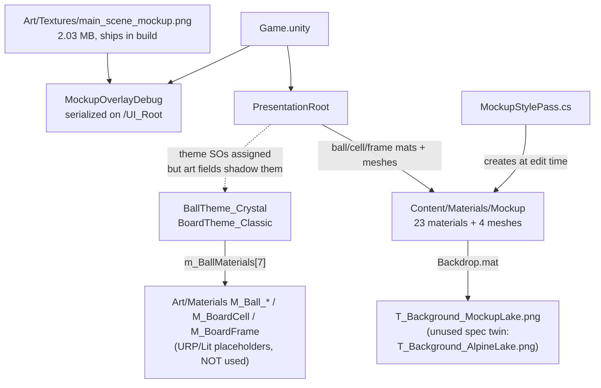

# Plan — Clean the Mockup Assets (LINE 98)

## 0. Verdict

The live `Game.unity` is wired to a **27-asset "Mockup" junk drawer** created by a one-shot editor script, and the design reference PNG (2.03 MB) sits inside `Assets/` as a runtime sprite. The good news: the mockup materials are *better* than their canonical `Assets/Art/Materials/M_*` twins (those are bare `URP/Lit` placeholders), so the cleanup is a **promotion**, not a rebuild.

**Headline guarantee: Phases 1–3 are path-only changes.** They use `move_asset` (GUID-preserving), so no material, mesh, colour, or shader parameter changes — the render is pixel-identical. The only *visible* changes are deliberately quarantined in Phase 5 behind a visual gate.

---

## 1. What exists today (verified evidence)

### 1.1 Live mockup residue

| # | Asset(s) | Current path | Referenced by | Action |
|---|---|---|---|---|
| 1 | `Ball_0…6.mat` (7) | `_Project/Content/Materials/Mockup/` | `Game.unity` → `PresentationRoot.m_BallMaterials[0..6]` | **Promote** → `Art/Materials/M_Ball_{Red,Orange,Yellow,Green,Cyan,Purple,Blue}.mat` |
| 2 | `BoardCell.mat`, `BoardFrame.mat` | same folder | `Game.unity` → `m_CellMaterial`, `m_FrameMaterial` | **Promote** → `M_BoardCell`, `M_BoardFrame` |
| 3 | `Card, Action, Square, Tray, Hint, HintGlow` (6) | same folder | `Game.unity` UI `Image.m_Material` | **Promote** → `Art/Materials/UI/M_Ui_*.mat` |
| 4 | `Shadow_Card_{Score,Next,Best}`, `Shadow_Btn{Undo,NewGame,Settings,Stats}` (7) | same folder | `Game.unity` UI `Image.m_Material` | **Promote** → `Art/Materials/UI/M_Ui_Shadow_*.mat` |
| 5 | `Backdrop.mat` | same folder | `Game.unity` → `/Background_Backdrop` renderer | **Promote** → `Art/Materials/M_Backdrop.mat` (+ background decision, §3 D16) |
| 6 | `Cell.asset`, `Frame.asset`, `Gem.asset`, `Backdrop.asset` (4 meshes, wrongly living in a *Materials* folder) | same folder | `Game.unity` → `m_CellMesh`, `m_FrameMesh`, `m_BallMesh`, backdrop `MeshFilter` | **Promote** → `Art/Meshes/MESH_*.asset` |
| 7 | `T_Background_MockupLake.png` (941×1672, 1.69 MB) | `Art/Textures/` | `Mockup/Backdrop.mat` `_BaseMap` | **Consolidate** with the spec asset (D16) |
| 8 | `main_scene_mockup.png` (941×1672, 2.03 MB) | `Art/Textures/` **and** repo root | `Game.unity` → `MockupOverlayDebug.m_MockupSprite` | **Move out of `Assets/`** → `Docs/Design/`; delete root duplicate (md5 `a6d13f66…` — byte-identical) |
| 9 | `MockupStylePass.cs` (270 LOC, menu `Line98/UI/Apply Mockup Style`) | `_Project/Editor/` | Editor tool — *generates* #1–#6, rewrites the scene, theme SO, URP asset and lights | **Retire** (delete after promotion) |
| 10 | `MockupOverlayDebug.cs` + instance on `/UI_Root` | `_Project/Presentation/UI/` | `Game.unity` (serialized component + sprite) | **Convert to editor-only tool** (never serialized) |
| 11 | `UIHierarchyBuilder.cs` L37–79 | `_Project/Editor/` | Editor tool — loads the mockup sprite, adds the overlay | **Strip mockup wiring**, move to `Line98/Dev/` |
| 12 | `ui_cell_recessed.png`, `ui_board_frame.png`, `ui_button_square_neumorphic.png`, `ui_btn_center_nav_dpad.png` | `Art/Sprites/UI/` | **nothing** | Delete + doc reconciliation |
| 13 | `Assets/InitTestScened91c5e99-…unity` (+meta) | `Assets/` root | test-run leftover | Delete |
| 14 | `Content/{Audio,Localization,Prefabs,Themes}` | empty folders | — | Keep (milestone placeholders) or drop |

Known orphaned-but-spec'd textures, **keep** (feature-pending): `T_Ball_InnerRefraction_Mask.png`, `T_Ball_Accessibility_Patterns.png` — `BallTheme_Crystal` has both fields `{fileID: 0}` (GDD gap #11 accessibility is unimplemented).

### 1.2 Current reference graph



Two structural smells beyond naming: (a) **two sources of truth** for art (scene-serialized fields *and* theme SOs), and (b) the mockup generator is the only thing that can reproduce these assets.

---

## 2. Target state

```text
Assets/
  Art/
    Materials/            M_Ball_*.mat (7, Line98/PolishedBall)  M_BoardCell  M_BoardFrame  M_Backdrop
      UI/                 M_Ui_Card  M_Ui_Action  M_Ui_Square  M_Ui_Tray  M_Ui_Hint  M_Ui_HintGlow
                          M_Ui_Shadow_*.mat (7)
    Meshes/               MESH_BoardCell  MESH_BoardFrame  MESH_Ball_Gem_Centered  MESH_Backdrop_Quad
    Models/               SM_*.obj (DCC sources of record, incl. the live SM_BlobShadow)
    Textures/             T_* (spec assets only)
    Sprites/{UI,Balls,VFX}/
  _Project/Content/       Definitions, Scenes, Shaders, Rendering  ← no loose art, no "Mockup"
Docs/
  Design/main_scene_mockup.png     ← reference art lives OUTSIDE Assets (no import, no GUID, no build cost)
  AssetConventions.md              ← new: naming + folder authority + banned tokens
```

Conventions enforced after cleanup: `M_*` material · `MESH_*` Unity-baked mesh · `SM_*` DCC source · `T_*` texture · `sp_*`/`ui_*` sprite · **no asset path under `Assets/` may contain `mockup|mock|temp|copy|final|new|placeholder`**.

---

## 3. Decisions to approve

| # | Decision | Recommendation |
|---|---|---|
| **D14** | Promotion strategy | **Move, don't re-author.** GUID-preserving `move_asset` keeps 32 scene references and all tuned `FrostedPanel` parameters (`_Size/_Radius/_Border/_Inset/_Padding/_Feather`, render queues) intact. Re-authoring by hand would silently lose the tuning. |
| **D15** | Fate of the 9 canonical placeholders (`M_Ball_*`, `M_BoardCell`, `M_BoardFrame`) | Pre-wire the theme SOs → mockup GUIDs **first**, then delete the placeholders, then move the mockup assets onto the freed paths. Sequence matters (move requires a free destination) — see Phase 1. |
| **D16** | Background texture | Consolidate to **one** canonical `T_Background_AlpineLake.png`, chosen by visual review between the two 941×1672/1080×2160 candidates. I can't judge art from here — this needs your eyes on a capture. |
| **D17** | Design reference location | `Docs/Design/main_scene_mockup.png`, loaded by an **editor-only** overlay via `File.ReadAllBytes`+`Texture2D.LoadImage`. Nothing ships, no importer, no scene reference. |
| **D18** | UI element ownership rule | An `Image` carries **either** a Sprite **or** a custom material — never both, never a stale nulled reference (confirmed drift: `BtnUndo`'s live `m_Sprite` is `null` while `ui_btn_action_undo.png` is still loaded by the scene). |
| **D19** | Theme SOs as the single source of truth | Make `BallThemeSO`/`BoardThemeSO` authoritative for meshes + materials + backdrop, and empty `PresentationRoot`'s duplicated `[Header("Art Assets")]` block. This is what makes GDD §16 cosmetics swap-able by data. |

---

## 4. Execution plan (drive the **live Editor** — one is connected on :7800, `6000.6.0f1`)

> Gotcha: in Git Bash a leading-slash target gets path-mangled (`/UI_Root` → `C:/Program Files/Git/UI_Root`). Target scene objects by `instanceId`/`globalId`, or run these from PowerShell.
> Gotcha: `unity command` (bare) opens a pager and hangs — always pass `--no-pager --no-banner`.

### P0 — Baseline & safety (15 min)
```bash
git tag pre-mockup-cleanup                       # your call, in your terminal
unity command list_open_scenes --format json --no-pager --no-banner
unity command open_scene --path Assets/_Project/Content/Scenes/Game.unity
unity command editor_play                        # then capture a before-state
unity command capture_game_view --source screen --save_path Docs/Design/baseline_before.png
unity command get_performance_stats --format json
# dependency snapshot (proves what the scene actually pulls in):
unity command eval 'System.IO.File.WriteAllLines("Docs/deps_before.txt", UnityEditor.AssetDatabase.GetDependencies("Assets/_Project/Content/Scenes/Game.unity"));'
```
Commit the baseline capture. Record draw calls + texture memory as the regression gate.

### P1 — Promote ball/board materials (zero visual change)
For `i = 0..6` in `BallColor` order (D9 already renamed `Pink`→`Blue`, so: Red, Orange, Yellow, Green, Cyan, Purple, Blue):

1. Re-point the theme to the *mockup* asset (still valid, placeholder becomes unreferenced):
   `set_serialized_field --target Assets/_Project/Content/Definitions/BallTheme_Crystal.asset --field m_BallMaterials.Array.data[i] --value <ObjectRef → Mockup/Ball_i.mat>`
2. `delete_asset --asset Assets/Art/Materials/M_Ball_<Color>.mat --confirm true` (frees the canonical path)
3. `move_asset --asset Assets/_Project/Content/Materials/Mockup/Ball_i.mat --destination Assets/Art/Materials/M_Ball_<Color>.mat`
4. Repeat for `BoardCell`/`BoardFrame` against `BoardTheme_Classic.m_BoardCellMaterial` / `m_BoardFrameMaterial`.

Verify ObjectRef JSON shape with `unity command set_serialized_field --help` and rehearse each step with `--dry_run`.

**Gate:** `get_serialized_fields` on `PresentationRoot` + both theme SOs → all four art slots resolve to `Assets/Art/Materials/…`; `capture_game_view` diff is byte-identical to P0.

### P2 — Promote UI + backdrop materials
`create_folder --path Assets/Art/Materials/UI`, then straight `move_asset` for the 6 panel materials and 7 shadows (`M_Ui_*` / `M_Ui_Shadow_*`), plus `Backdrop.mat` → `Art/Materials/M_Backdrop.mat`. No reference rewiring needed (GUIDs survive).

### P3 — Promote baked meshes
`create_folder --path Assets/Art/Meshes`, then `move_asset` → `MESH_BoardCell.asset`, `MESH_BoardFrame.asset`, `MESH_Ball_Gem_Centered.asset`, `MESH_Backdrop_Quad.asset`.

> Preserve the two baked conventions deliberately: the gem's z-shift (`restOffset = 0.30/tan(58°)`, floor-pivot contract) and `BoardTheme_Classic.m_RowPitchScale = 1.1791784 = 1/sin(58°)`. Document both in `AssetConventions.md`; re-authoring the pivot in Blender is an M2 art task, not part of this cleanup.

### P4 — Retire the mockup tooling
1. Delete the `MockupOverlayDebug` component instance from `/UI_Root` (target by `instanceId`), clear the sprite field, `save_scene`.
2. `delete_asset --confirm` on `MockupStylePass.cs`.
3. Replace the overlay with an editor-only alignment tool: `Line98/Dev/Show Design Reference Overlay` that creates a transient overlay (F9) and **never saves the scene**.
4. In `UIHierarchyBuilder.cs`: remove the mockup sprite load + overlay wiring (L40–46, L74–79), prune its sprite list per P5, and move its menu under `Line98/Dev/` with a header saying the authored scene is the source of truth.
5. Keep the mockup pass's *persisted side effects* that are good (URP `msaaSampleCount = 4`, the studio light rig) — they're already saved in `UniversalRP.asset` / the scene.

### P5 — Background + UI ownership audit (**visual gate here**)
1. Capture both background candidates side by side; pick one; set `_BaseMap` via `set_material_properties`, fix import via `set_import_settings` (sRGB, clamp, ≤2048, ASTC 6×6 override), delete the loser, keep the canonical name.
2. Walk every `Image` under `UI_Root`: enforce D18 (null the losing side). Confirmed candidates to null-and-delete: `ui_btn_action_undo/newgame`, `ui_icon_*` superseded by `HudIconGraphic` vectors, `ui_card_hud_container`, `ui_tray_next_balls_recessed`, `ui_brand_logo_text`, plus the four already-orphaned sprites from §1.1 #12. **Keep** `sp_ball_*.png` (live in `PreviewQueueView`) and `ui_overlay_modal_scrim` (if popups use it).
3. Prove each orphan with `AssetDatabase.GetDependencies` **before** deleting — don't trust a snapshot.
4. `git mv` the design reference to `Docs/Design/`, delete the root duplicate, `AssetDatabase.Refresh`.
5. Delete the stray `InitTestScened91c5e99-….unity`.

### P6 — Guardrails & docs
New `Assets/_Project/Tests/EditMode/AssetHygieneTests.cs`:
- no path under `Assets/` matches `(?i)mockup|mock|copy|temp|placeholder`
- `BallTheme_Crystal` has 7 materials, all under `Art/Materials/`, shader `Line98/PolishedBall`, 7 distinct `_BaseColor` hues
- `BoardTheme_Classic` materials resolve under `Art/Materials/`
- **build-dependency guard:** `AssetDatabase.GetDependencies("…/Game.unity")` contains no `/Mockup/` path and no reference to the design reference PNG
- no `Art/Materials` ball/board material uses `Universal Render Pipeline/Lit`

Also: rename `BoardViewTests.MockupRowDepth_…` and `UiLayoutTests.Solve_ReferenceResolution_MatchesMockupLayoutSpec`; add `Docs/AssetConventions.md`; update `LINE_98_Design_assets.md` §2/§4/§7 (mark superseded sprites, add `M_Ui_*`/`MESH_*`/`M_Backdrop`) and `Docs/Decisions.md` (D14–D19).

**Commit as one change:** `chore(art): promote mockup assets to the canonical art pipeline`.

---

## 5. Verification & acceptance

| Check | Command / artefact | Pass condition |
|---|---|---|
| Reference integrity | `get_serialized_fields` on `PresentationRoot` + 2 theme SOs | every art slot → `Assets/Art/**`, zero `/Mockup/` |
| No visual regression (P1–P3) | `capture_game_view --source screen` vs. P0 | identical board/balls/UI |
| Intentional change (P5) | new capture vs. P0 | only backdrop/sprite changes, signed off |
| Build cost | deps diff + `unity build --target Android` AAB | mockup PNG gone; est. ≈0.5–0.9 MB texture saving at ASTC 6×6 (estimate) |
| Logic untouched | `unity test --mode EditMode` then `--mode PlayMode` | all green, including the new hygiene suite |
| Draw calls | `get_performance_stats` before/after | unchanged (moves only) |
| Compiler | IL2CPP build, `-warnaserror` | no new warnings |

---

## 6. Risks

| Risk | Mitigation |
|---|---|
| Deleting a canonical placeholder still referenced by a theme SO | Re-point first, then delete (Phase 1 order); rehearse with `--dry_run` |
| `move_asset` breaks a hard-coded path in code | Only 3 files hold `"Assets/…"` literals: `MockupStylePass` (deleted), `UIHierarchyBuilder` (edited in P4), `ProjectSetup` (no art paths) — verified by grep |
| Editor dirty/compile state mid-run | Do asset ops out of Play mode; `save_all` before moves; single commit at the end |
| Deleting brand-new art you can't evaluate | Nothing is deleted until Phase 5; P1–P4 delete only generator output and the byte-identical duplicate |
| Losing the pixel-alignment workflow | Replaced by the editor-only `Docs/Design` overlay + the existing layout tests that already lock the 1080×1920 numbers |

**Rollback:** `git tag` + GUID-preserving moves mean a branch switch restores the exact prior state; no manual reference repair.
